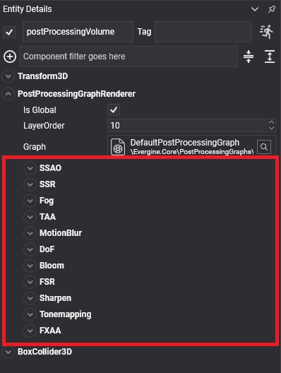

# Default Postprocessing graph
---
Default Evergine project template imports the [**Evergine.Core** package](../packages.md) and this package includes the Default Post-Processing graph with the most important post-processing visual effect common in a project.

The complete list of postprocessing effects cover by the default postprocessing graph are:

* [Screen Space Ambient Occlusion (SSAO)](screen_space_ambient_occlusion.md)
* [Screen Space Reflection (SSR)](screen_space_reflection.md)
* [Fog](fog.md)
* [Temporal Anti-Aliasing (TAA)](temporal_anti_aliasing.md)
* [Motion Blur](motion_blur.md)
* [Depth of Field (DoF)](depth_of_field.md)
* [Bloom, Dirt, LensFlare, LightShaft](bloom.md)
* [Fidelity Super Resolution (FSR)](fidelity_super_resolution.md)
* [Sharpen](sharpen.md)
* [Tonemapping, Chromatic aberration, Vignette, Grain, Distortion](tonemapping.md)
* [Fast approximate anti-aliasing (FXAA)](anti-aliasing.md)

## Using default postprocessing graph from Evergine studio
These effects can be configure from PostprocessingGraphRenderer component inside of a postprocessing volume entity.

