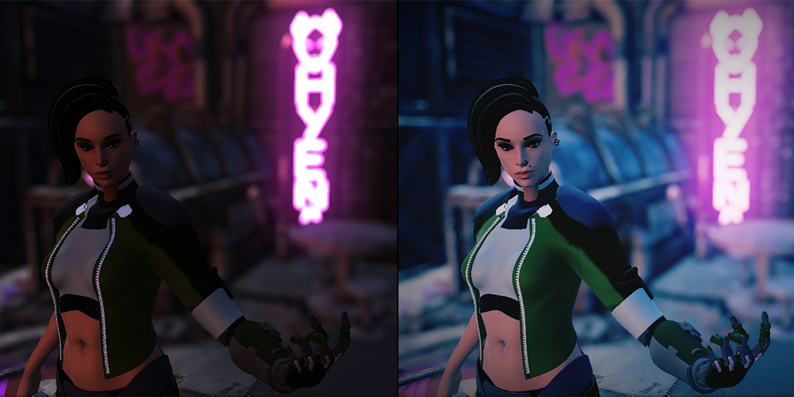
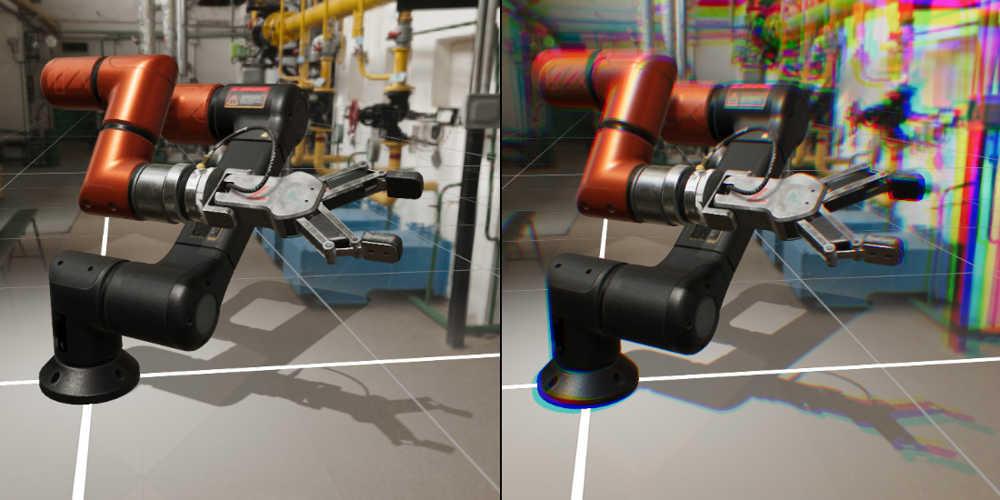

# Tonemapping, Chromatic aberration, Vignette, Grain, Distortion

---

In this section, multiples effects are explained because the process steps to calculate them are similar and they was implemented together for performance reason.

## Tonemapping

**Tonemapping** is a technique used in image processing and computer graphics to map one set of colors to another to approximate the appearance of high-dynamic-range images in a medium that has a more limited dynamic range.

In the above image the left side is the render without tonemapping applied and the right side is the result of to apply tonemapping to the left side.

| Parameter  | Description |
| ---------- | ----------- |
| HDR Enabled | Enabled/Disabled mapping of High Dynamic Range (HDR) to Low Dynamic Range (LDR). |
| Curve       | Defines how to map the image color to output image. There are the following curves availables: Reinhard, ReinhardSQ, LumaReinhard, Filmic, ACES, RombindAHouse. Default curve is ACES.|
| LUT Enable  | Enabled/Disabled use the Lookup Table (LUT) Texture table to map de colors |
| LUT Texture | Represents a Lookup Table (LUT) 16x16x16 color neutral unwrapped to a 256x16 texture.   There are two LUT Texture samples:    HDR:   Vintage: |

## Chromatic aberration

Chromatic aberration, also known as “color fringing” or “purple fringing”, is a common optical problem that occurs when a lens is either unable to bring all wavelengths of color to the same focal plane, and/or when wavelengths of color are focused at different positions in the focal plane. Chromatic aberration is caused by lens dispersion, with different colors of light travelling at different speeds while passing through a lens. As a result, the image can look blurred or noticeable colored edges (red, green, blue, yellow, purple, magenta) can appear around objects, especially in high-contrast situations.

In the above image the left side is the render withou chromatic aberration applied and the right side is the result of to apply chromatic aberration to the left side.

| Parameter  | Description |
| ---------- | ----------- |
| Strength   | Defines the distance between color bands. |
| Offset     | Defines vector direction of the aberration. |

## Grain

If you’ve watched a film and seen speckles on the screen in random patterns, you’ve seen film grain. Originally, the actual grains in film grain were small particles of silver halide, the primary photosensitive substance used in chemical film. These particles are randomly distributed artifacts throughout the image.

| Parameter  | Description |
| ---------- | ----------- |
| Intensity | Defines the intensity of the grain effect. |

## Vignette

A vignette is a decrease in brightness of a photograph towards its edges compared to the image centre. Vignetting is often an undesired effect caused by camera settings that are not suitable for the given light situation. However, the effect can also be added subsequently to create noticeable changes in the picture’s mood and perception by making subtle changes only.

| Parameter  | Description |
| ---------- | ----------- |
| Power      | Defines the intensity of the vignette effect. |
| Radio      | Defines the radio of the effect respect to the center image. |

## Distortion

This is a visual effect that simulates the effect produced by the refraccion of the light. Refraction produces when you see through the vidrio or the fire smoke could be some examples of this effect.

> [!Tip]
> This effect required to use the **[Distortion Material](../../effects/builtin_effects.md)** include in the [**Evergine.core** package](../../../evergine_studio/packages.md)

