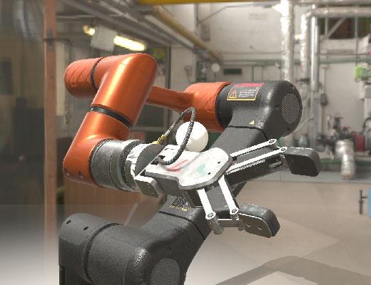
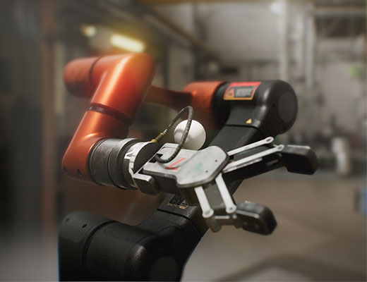

# Postprocessing Graph
---

The Post-Processing graph allows you to apply visual effects like Tonemapping, Depth of Field, Temporal Anti-Aliasing, SSAO, SSR, etc., to your scene's final render. The Post-Processing graph is composed of interconnected nodes that apply visual effects to the output render before displaying it on the screen. Each node is a compute [effect](../effects/index.md).

Using Post-Processing, you can achieve a cinematic appearance for your applications:

| Post-Processing Disabled | Post-Processing Enabled |
| --- | --- |
| |  |

## Post-Processing and Compute Effects

A post-processing graph is a group of compute effect nodes that apply effects to the initial render node and connect the result to the final Screen node. You can create a post-processing graph with a single node or multiple nodes, depending on your requirements. Post-Processing graphs are a type of [asset](index.md) and have a dedicated Editor named the [**Post-Processing Graph Editor**](postprocessing_graph_editor.md).

## Default Post-Processing Graph

In Evergine, the default project template imports the [**Evergine.Core** package](../../addons/index.md), which includes the Default Post-Processing graph with the most common post-processing visual effects used in a project. Therefore, most of the time, you will use this asset, creating a new custom post-processing graph only to develop new visual effects or to meet performance needs.

## In this section

* [Create Postprocessing Graph](create_postprocessing_graphs.md)
* [Using Postprocessing Graph](using_postprocessing_graphs.md)
* [Postprocessing Graph Editor](postprocessing_graph_editor.md)
* [Default Postprocessing Graph](default_postprocessing_graph/index.md)
* [Custom Postprocessing Graph](custom_postprocessing_graph.md)
* [Create Custom Postprocessing Graph from Code](create_postprocessing_graphs_from_code.md)