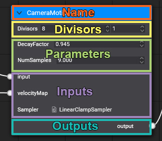

# Postprocessing Graph Editor
---

**Postprocessing Graph Editor** allows editing the Postprocessing Graph assets. Double click over a postprocessing graph asset shown in [Assets Details](../../evergine_studio/interface.md) will open this editor. The editor is composed of 3 main parts: 
* Graph Editor
* Compute Effects collection
* Viewport.

## **Graph Editor**

The **Graph Editor** allows you to create graph nodes to connect the start node (_Render_) with the last node (_Screen_). The nodes are computed effects and his parameters, input, and output are defined by his ResourceLayout block.

| Node elements | Description |
| ------------- | ----------- |
| **Name**          | Located on top of the Node is the name of the compute effect used. |
| **Divisors**      | Allows configure the ThreadGroupDivisor X,y and Z to dispatch the compute effect.
| **Parameters**    | Allows configuring constant buffer or structure buffer properties to the compute effect. |
| **Input**         | Allows set Textures and Samplers to the compute effect. |
| **Output**        | Allows set RWTextures to the compute effect. |

> [!Tip]
>The node inputs can only be connected with a single node output but a node output can be connected with multiple node inputs.

### **Toolbox**

The toolbox is located on the top side of the graph editor and allows to manipulate the graph view.

| Icon  | Description |
| ----- | ----------- |
|| Delete the selected node. |
|    | Execute an algorithm to relocated nodes and avoid node overlapping. |
|  | Zoom in/out the graph. |
| | Center the view over the graph. |

| Actions | Description |
|---------| ----------- |
| **Left mouse button** | Selection tool. Allows to select a single or multiple nodes.|
| **Right mouse button** | Cut tool. Allows the draw a cut line to break conections.|
| **Medium mouse button** | Pan tool. Allows to move along the graph.|
| **Mouse wheel** | Allows to make zoom in/out over the graph.  |

## **Compuse Effects Collection**
In this panel, you can find all compute effects existing in the project and drag an effect to the graph editor to use it.

## **Viewport**
The vewport allows to inspect the result of the postprocessing graph applied to the scene:

> [!NOTE]
> To refresh the graph changes in the viewport, you need to save all graph changes.

| Icon  | Description |
| ----- | ----------- |
|| The combobox allows to select the current scene for the viewport.|
|    | Opens the camera settings to configure all its parameters. The camera changes are not stored so it is only for testing proposes. |

The viewport allows you a simple interaction to easily inspect the scene:

| Actions | Description |
|---------| ----------- |
| `W`, `S`, `D`, `A` | Move camera along the scene.|
| **Right mouse button** | Rotates camera. |
| **Medium mouse button** | Camera panning. |
| **Mouse wheel** | Camera zoom in/out.  |