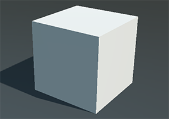
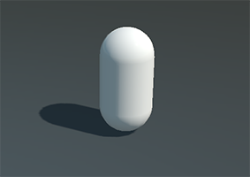
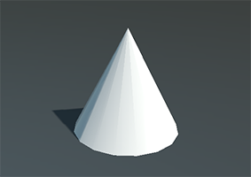
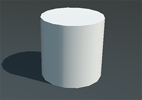
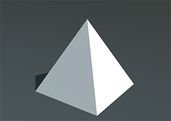
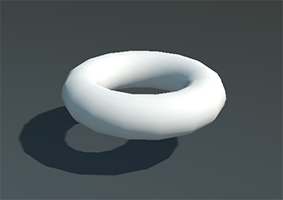

# Primitives
---


Evergine has a 3D **primitives** collection that you can use for prototyping proposes. The primitives are easier and faster to use so they are very useful when you are making tests or your creating a prototype scene.

Primitive collection:

* Capsule
* Cone       
* Cube       
* Cylinder   
* Plane      
* Pyramid
* Sphere
* Teapot
* Torus

The main difference of using primitives instead of a [Model](models/index.md) is that in that case the Mesh is generated procedurally, instead of obtaining it from an asset. It allows you to parametrice the way this mesh is generated.

## Create primitive from Evergine Studio
From the Entity Hierarchy panel click on button and go to Primitives 3D submenu.


## Create primtive from code
To create a primitive only need to create an entity with the following components:

```csharp
protected override void CreateScene()
        {
            var assetsService = Application.Current.Container.Resolve<AssetsService>();

            var material = assetsService.Load<Material>(EvergineContent.Materials.DefaultMaterial);

            Entity cubeEntity = new Entity()
                .AddComponent(new Transform3D())
                .AddComponent(new MaterialComponent() { Material = material })
                .AddComponent(new CubeMesh()) // A cube primitive
                .AddComponent(new MeshRenderer());

            this.Managers.EntityManager.Add(cubeEntity);
        }
```
> [!Tip]
> To create primitive only need to change _CubeMesh_ component by _CapsuleMesh_, _ConeMesh_, _CylinderMesh_, _PlaneMesh_, _PyramidMesh_, _SphereMesh_, _TeapotMesh_ or _TorusMesh_ component.

## Cube Parameters



The component for create this primitive is `CubeMesh`

| Parameter  | Description |
| -----------| ----------- |
| **Size** | The size of the cube. Must be greater than 0. |
| **UVHorizontalFlip** | Value indicating whether to flip the horizontal texture coordinate.|
| **UVVerticalFlip** | Value indicating whether to flip the vertical texture coordinate.|
| **InitialU** | The horizontal texture coordinate offset.|
| **InitialV** | The vertical texture coordinate offset. |
| **UTile** | The horizontal texture coordinate scale factor.|
| **VTile** | The vertical texture coordinate scale factor.|

## Sphere Parameters


The component for create this primitive is `SphereMesh`

| Parameter  | Description |
| -----------| ----------- |
| **Diameter** | The diameter of the sphere. Must be greater than 0. |
| **Tessellation** | The tessellation of the sphere. Must be greater than 3. |
| **UVHorizontalFlip** | Value indicating whether to flip the horizontal texture coordinate.|
| **UVVerticalFlip** | Value indicating whether to flip the vertical texture coordinate.|

## Plane Parameters


The component for create this primitive is `PlaneMesh`

| Parameter  | Description |
| -----------| ----------- |
| **PlaneNormal** | The normal of the plane. Availables values: <ul><li>XPositive</il><li>YPositive</il><li>ZPositive</il><li>XNegative</il><li>YNegative</il><li>ZNegative</il></ul> |
| **Width** | The width of the plane. Must be greater than 0.|
| **Height** | The height of the plane. Must be greater than 0. |
| **TwoSides** | Value indicating whether the plane has two sides. By default botton face of the plane is not generated. |
| **UMirror** | Value indicating whether to flip the horizontal texture coordinate.| 
| **VMirror** | Value indicating whether to flip the vertical texture coordinate.|
| **UOffset** | Apply an offset to the horizontal texture coordinates. |
| **VOffset** | Apply an offset to the vertical  texture coordinates. |
| **UTile** | The horizontal texture coordinate scale factor.|
| **VTile** | The vertical texture coordinate scale factor.|
| **Origin** | Represent the pivot in a normalized position. By default the value is (0.5, 0.5), which indicatest that the PlaneMesh position is measured from the center of the plane. |

## Teapot Parameters


The component for create this primitive is `TeapotMesh`

| Parameter  | Description |
| -----------| ----------- |
| **Size** | The size of the teapot. Must be greater than 0. |
| **Tessellation** | The tessellation of the teapot. Must be greater than 3.|

## Capsule Parameters



The component for create this primitive is `CapsuleMesh`

| Parameter | Description |
| -----------| ----------- |
| **Height**     | The height of the capsule. Must be greater than 0. |
| **Radius**     | The radius of the capsule. Must be greater than 0. |
| **Tessellation** | the tessellation of the capsule. Must be even. |

## Cone Parameters



The component for create this primitive is `ConeMesh`

| Parameter  | Description |
| -----------| ----------- |
| **Height**   | The height of the cone. Must be greater than 0. |
| **Diameter** | The diameter of the cone. Must be greater than 0. |
| **Tessellation** | The tessellation of the cone. |

## Cylinder Parameters



The component for create this primitive is `CylinderMesh`

| Parameter  | Description |
| -----------| ----------- |
| **Height** | The height of the cylinder. Must be greater than 0. |
| **Diameter** | The diameter of the cylinder. Must be greater than 0. |
| **Tessellation** | The tessellation of the cylinder. Must be greater than 3. |

## Pyramid Parameters



The component for create this primitive is `PyramidMesh`

| Parameter  | Description |
| -----------| ----------- |
| Size  | The size of the pyramid. Must be greater than 0. |

## Torus Parameters



The component for create this primitive is `TorusMesh`

| Parameter  | Description |
| -----------| ----------- |
| **Diameter** | The diameter of the torus. Must be greater than 0.|
| **Thickness** | The thickness of the torus. Must be greater than 0. |
| **Tessellation** | The tessellation of the torus. Must be greater than 3. |

