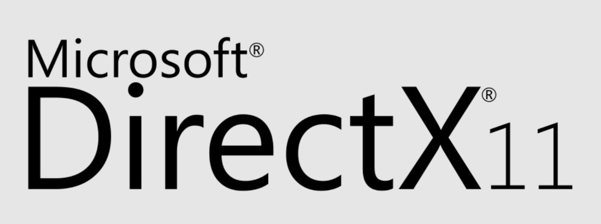

# DirectX 11



**DirectX 11** is one of the most popular graphics APIs used on graphics applications created by **Microsoft** and supported on all computers using the Windows OS.
**Microsoft** announce DirectX 11 at the Gamefest 2008 event in Seattle and since then three updates were released:

* DirectX 11.1 was included in Windows 8
* DirectX 11.2 was included in Windows 8.1
* DirectX 11.3 was released in 2015 and was included in Windows 10.

Currently is the most popular graphics API on Windows platform and supported on all devices running Windows 10.
This is the default graphics APIs used by the **Evergine Studio** as well.

## Supported DirectX 11 devices

* Windows 8/10/11 x64/x86 desktop
* Windows 10/11 ARM64/x86 tablet
* HoloLens 2 ARM64

## Checking DirectX 11 version

The DxDiag tool reports detailed information about the DirectX components and drivers installed on your Windows system and it is available on Windows 7/8/10/11.
To get the latest DirectX version on your system used Windows update, not all version of Windows can run the latest version of DirectX 11.

For more information visit [Microsoft support.](https://support.microsoft.com/en-us/windows/checking-your-version-of-directx-7b71e74f-02e8-456f-72c7-9a1c1bbf0e9a)

## Create a Graphics Context

To create a graphics context based on **DirectX11** just write:

```csharp
GraphicsContext graphicsContext = new Evergine.DirectX11.DX11GraphicsContext();
graphicsContext.CreateDevice();
```

## Build & Run

DirectX 11 is used by default for **Evergine** so not actions are required to active it.

You can run on **DirectX 11** by clicking on File -> Build & Run -> Windows.DirectX11 or just press F5 inside the **Evergine Studio**.

