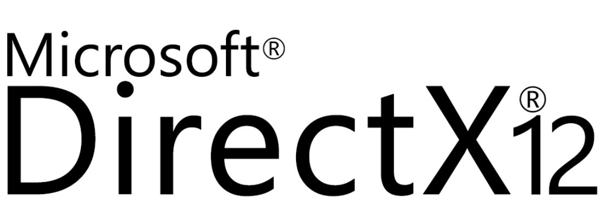

# DirectX 12

**DirectX12** is the latest **Microsoft** graphics API available on all devices running Windows 10/11.
**Microsoft** announced this version at GDC on March 20 2014, and was officially launched alongside Windows 10 on July 29 2015.
At October 2 2018 the DirectX Raytracing support was added to the API and it become very popular quickly and currently all the latest GPUs from Nvidia and AMD come with Raytracing support which is supported on **Evergine** low level API.

## Supported DirectX 12 devices

* Windows 10/11 x64/x86 desktop
* Windows 10/11 ARM64/x86 tablet

## Checking DirectX 12 version

The DxDiag tool reports detailed information about the DirectX components and drivers installed on your Windows system and it is available on Windows 10/11.
To get the latest DirectX version on your system used Windows update.

For more information visit [Microsoft support.](https://support.microsoft.com/en-us/windows/checking-your-version-of-directx-7b71e74f-02e8-456f-72c7-9a1c1bbf0e9a)

## Build & Run on DirectX 12

You can select **DirectX 12** API support during the new project creation from the **Evergine** launcher.

If the project already exists you can add the **DirectX 12** support from **Evergine Studio** by clicking on Settings -> Project Settings.

Selecting and adding the profile for Windows (DirectX12).

You can run on **DirectX 12** by clicking on File -> Build & Run -> Windows.DirectX12.

