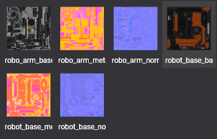

# Import a texture

In **Evergine Studio**, importing an image file will create a **Texture** asset, as explained [in this article](../../evergine_studio/assets/create.md).

## Inspect Textures in Asset Details
You can find the texture assets in the Assets Details panel when you select a folder in the Project Explorer.

## Texture files in content directory

**Textures** imported in **Evergine** create an aditional metadata `.wetx` file.

## Supported formats:
**Evergine** supports the following image formats:

| Extension | Compression | Alpha | Bits per pixel | Supported texture types | 
| ----| ----| ---- | ---- | ---- |
| `.jpg`, `jpeg` | Lossy compression. Configurable | No | 24 |  Texture2D |
| `.png` | Lossless compression | Yes | 8, 24, 48 |Texture2D |
| `.bmp` | No compression | Yes (not common) |  24  | Texture2D |
| `.gif` | Indexed colors | Yes | 8 |  Texture2D |
| `.tga` | No | Yes | 32 | Texture2D |
| `.hdr` | No | No | 48 or 96 (high dynamic range) | Texture2D |
| `.dds` | Yes (S3, DXT1, DXT3, DXT5)  | Yes | Multiple | Texture2D, Texture2DArray, Texture1D, Texture1DArray, TextureCube, TextureCubeArray, Texture3D|
| `.ktx` |  Yes (ETC1S) | Yes | Multiple | Texture2D, Texture2DArray, Texture1D, Texture1DArray, TextureCube, TextureCubeArray, Texture3D |

## Sampler State association
A **Texture** graphic resource needs a **Sampler State** asset for properly filtering it. That's why the **Texture** asset contains a reference to a **SamplerState** of your project.

This way the Texture has a default **SamplerState** associated. **Evergine** will automatically use it.

