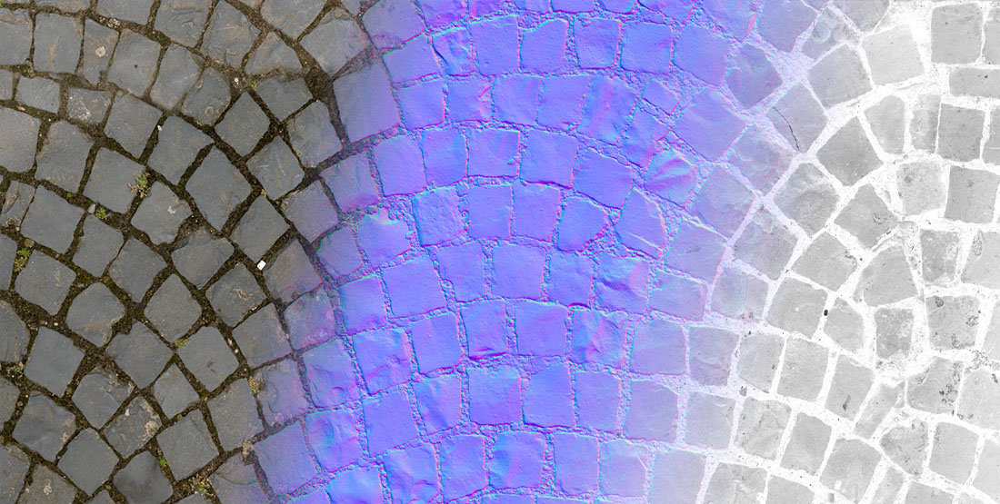
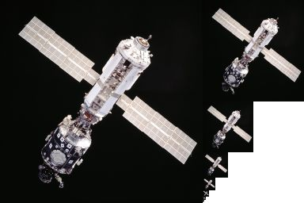

# Textures
---

**Textures** are assets that usually contains an image. In **Evergine** they are mostly used in materials to provide color detail in your application. How the **texture** is viewed in your application depends of the material itself. For example, a texture can be used as _diffuse_ or _emissive_ color information.

**Textures** can also be used in other areas, like **Sprites** or **UI** elements. 

## Mipmapping
**Evergine** also supports **mipmapping**. It can generate or loads the successive half reduction of the texture, consisting the **mip levels**. This process is crucial when dealing with **Texture Filtering** (_anisotropic_, _linear_, _bilinear_, etc).

## Texture types
**Evergine** supports these basic GPU textures types (They are detailed in this [section](textureTypes.md))

- Texture2D
- Texture1D
- Texture1DArray
- Texture2DArray
- TextureCube
- TextureCubeArray
- Texture3D

## Supported file types.
**Evergine** supports importing the following texture types:
- `.png`
- `.jpg`
- `.jpeg`
- `.bmp`
- `.gif`
- `.tga`
- `.dds`
- `.ktx`
- `.hdr`

> [!NOTE]
> **Evergine** will only import the first frame of any animated image file like `.gif` and will load like an static Texture.

## In this section
* [Texture types](textureTypes.md)
* [Import Textures](import_textures.md)
* [How to create a texture from code](create_texture_from_code.md)
* [Texture Editor](texture_editor.md)