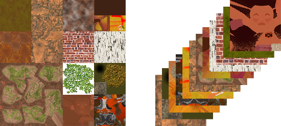
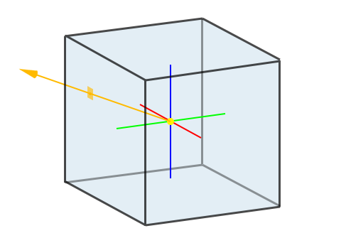

# Texture Types

Modern graphic APIs like **DirectX12** or **Vulkan** supports a wide range of **Texture types** because there are many ways that a **Texture** can be accessed and presented. **Evergine** supports all of them. However, some of them are only loaded using some specific image formats (like `.dds` or `.ktx`);

## Texture 2D

The classic **two dimensional** texture. It has **width** and **height** and as a graphic resource can be accessed using two texture coordinates **UV**. 

Almost every image file can be imported as a **Texture2D** asset because it's the most common one.

#### Usage
They are used for almost everything, like Sprites, Diffuse channel, Normal mapping.

## Texture 2D Array

The same as the **Texture2D** above, but it contains an array of textures.

Modern graphics APIs support **texture arrays**, which is an array of textures with the same size and format. They are treated as the same _graphic resource_, it also can have **mipmapping** information and can be sampled using an extra texture coordinate that indicates which array item is needed to be sampled. 

#### Usage
They are useful, for example, for creating sprite atlas or animations, which every element of the array containing a frame of the animation or atlas. 

## Texture 1D

Texture that only contains only one dimension ( **width** ) and are sampled using only one texture coordinate.

#### Usage
Useful when dealing with one dimensional info like **gradients**, for example.

## Texture 1D Array

Array of one dimensional textures as specified before. It's sampled using two texture coordinates: one for the texture address and another for the element in the array.

#### Usage
Using multiple gradients for a custom shader.

## Texture Cube

It's commonly known as **Cubemap**. It's a texture that contains 6 individual 2D textures that each form one side of a cube.  It has the useful property that they can be sampled using a direction vector instead of texture coordinates.

It's like having a 1x1x1 cube and a vector with the sampling direction at its center. It will return the texel placed in the intersection point. Like in the following diagram.

#### Usage
**TextureCubes** are mainly used as environment textures for IBL, like radiance and irradiance texture cubes for specular or diffuse components, or creating a **Skyboxes** for creating the background environment of your scene.

## Texture Cube Array

**Texture Cube Arrays** take a step further than the normal cubemap and stores an array of texture cubes, so they need an aditional coordinate to retrieve the element of the array.

#### Usage
**TextureCubesArray** is an intersting choice when creating **Reflection Probes** of your scene. in one resource can store all the probes of the scene.

## Texture 3D

A **3D Texture** is an image that contains information in three dimensions rather the standard two.

#### Usage
They are commonly used to simulate volumetric effects such fog, smoke, for raymarching operations or for sprite animation blending.
  