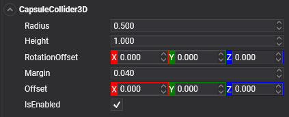

# Capsule Collider

A Capsule shaped collider.

A capsule is a special shape defined by two properties:
* **Radius:** The radius of the collider's local width.
* **Height:** The total height of the collider.

## SphereCollider3D component

To use a Sphere Collider in Evergine, you only need to add a `SphereCollider3D` component to your entity:

### Properties

| Property | Default | Description | 
| --- | --- | --- |
| **Radius** | 0.5 | This property define the radius of the Capsule collider.  <video width="600" height="220" autoplay loop><source src="images/capsule_collider_radius.mp4" type="video/mp4"></video> The **Radius** value can be used in two ways:<ul><li>If the Entity has a mesh (with `MeshComponent` for example), the Radius value is relative to the mesh extents.</li><li>If the entity hasn't any meshes, the Radius value is used as scene units.</li></ul>|
| **Height** | 1 | This property define the total height of the Capsule collider.  <video width="600" height="220" autoplay loop><source src="images/capsule_collider_height.mp4" type="video/mp4"></video> The **Height** value can be used in two ways:<ul><li>If the Entity has a mesh (with `MeshComponent` for example), the Height value is relative to the mesh height.</li><li>If the entity hasn't any meshes, the Radius value is used as scene units.</li></ul>|
| **Offset** | 0,0,0 | Offset the collider respect the owner entity.  <video width="600" height="220" autoplay loop><source src="images/capsule_collider_offset.mp4" type="video/mp4"></video> The **Offset** value can be used in two ways:<ul><li>If the Entity has a mesh (with `MeshComponent` for example), the Offset value is relative to the mesh extents.</li><li>If the entity hasn't any meshes, the Offset value is used as scene units.</li></ul> | 
| **Margin** | 0.04 | Physic Engine uses a small collision margin for collision shapes, to improve performance and reliability of the collision detection. | 