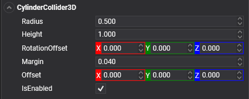

# Cylinder Collider

A Cylinder shaped collider.

## CylinderCollider3D component

To use a Cylinder Collider in Evergine, you only need to add a `CylinderCollider3D` component to your entity:

### Properties

| Property | Default | Description | 
| --- | --- | --- |
| **Radius** | 0.5 | This property define the radius of the Cylinder collider. The **Radius** value can be used in two ways:<ul><li>If the Entity has a mesh (with `MeshComponent` for example), the Radius value is relative to the mesh extents.</li><li>If the entity hasn't any meshes, the Radius value is used as scene units.</li></ul>|
| **Height** | 1 | This property define the total height of the Cylinder collider.The **Height** value can be used in two ways:<ul><li>If the Entity has a mesh (with `MeshComponent` for example), the Height value is relative to the mesh height.</li><li>If the entity hasn't any meshes, the Radius value is used as scene units.</li></ul>|
| **Offset** | 0,0,0 | Offset the collider respect the owner entity. The **Offset** value can be used in two ways:<ul><li>If the Entity has a mesh (with `MeshComponent` for example), the Offset value is relative to the mesh extents.</li><li>If the entity hasn't any meshes, the Offset value is used as scene units.</li></ul> | 
| **Margin** | 0.04 | Physic Engine uses a small collision margin for collision shapes, to improve performance and reliability of the collision detection. | 