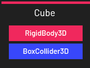
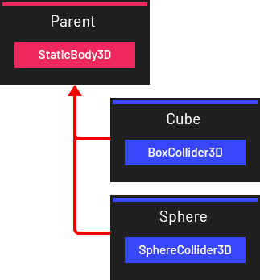

# Colliders
---

**Colliders** are used to define the physical shape of a [Physic Body](../physics_bodies/index.md). Colliders are invisible and don't need to be the exact same shape as the object mesh and in a fact, a rough approximation is often more efficient and indistinguishable in your application.

Evergine provides various collider types, such as Box, Sphere or Capsule. Using simple collider shapes helps with application performance optimizations. However, if you need more detailed and exact collision for your object, use the Mesh collider.

## Physics Bodies and Colliders

As we mentioned before in [Physics Bodies](../physics_bodies/index.md) section. A Collider needs a Physic Body to be attached, and a Physic Body itself needs Colliders to define their shape.

**A Physic Body search their attached collider in their child hierarchy**, including the owner's entity of the physic body. This also implies that a **Physic Body could have multiple colliders attached** to it.

### Simple shapes

This is the most common scenario. Your entity has a Physic Body component (`RigidBody3D` in that case), and one or more colliders attached to the same entity (`BoxCollider3D` in that case).

### Compound shapes

This is another possible scenario. In that case we have an entity hierarchy. In that case, the parent entity has a `StaticBody3D` component, and we have added several entities containing several colliders (a `BoxCollider3D` and a `SphereCollider3D`).

This cause that the final shape of the body is compounded of all attached colliders. 

> [!TIP]
> As a rule of thumb, create a physical body when you want to interact with it indistinguishable of other bodies. For example, to capture collision events.

## In this section
* [Box Collider](box_collider.md)
* [Sphere Collider](sphere_collider.md)
* [Capsule Collider](capsule_collider.md)
* [Cylinder Collider](cylinder_collider.md)
* [Cone Collider](cone_collider.md)
* [Mesh Collider](mesh_collider.md)
