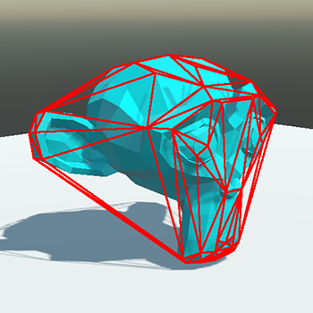
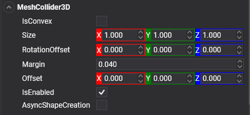

# Mesh Collider

A collider represented by an arbitrary mesh.

A **Mesh Collider** uses the owner entity meshes to define their shape. They use all `MeshComponent` to obtain meshes and create colliders with them.

## Types of Mesh Collider

### Default mode

By default, a Mesh Collider uses **the entire triangle mesh to generate a collider shape**. This will create the better precision and fidelity. However, only [Static Bodies](../physics_bodies/static_bodies.md) can have Mesh Colliders in the default mode.

Mesh Colliders in the default mode is more suitable to create collisions for static scenery objects, such as walls, terrain, props, etc...

> [!IMPORTANT]
> Only [Static Bodies](../physics_bodies/static_bodies.md) can have Mesh Colliders in the default mode.

### Convex Hull

If you want to use Mesh Colliders in dynamic bodies like [Rigid Bodies](../physics_bodies/rigid_bodies.md), you need to set your Mesh Collider to use a Convex Hull. After using this mode, the Physic Engine creates a convex approximation of the mesh, allowing it to be used in dynamic bodies. As a counterpart, the precision of the collision is degraded.

Convex colliders are suitable for movable physics objects like, chairs, tables, stones, etc...

## MeshCollider3D component

To use a Mesh Collider in Evergine, you only need to add a `MeshCollider3D` component to your entity.

> [!NOTE]
> Is obvious, but to use a `MeshCollider3D`, the owner entity is required to have at least one `MeshComponent`

### Properties

| Property | Default | Description | 
| --- | --- | --- |
| **Size** | 1,1,1 | This property allows you to scale the generated Mesh Collider. | 
| **Offset** | 0,0,0 | Position offset of the collider respect the owner entity. The units is relative of the size of the entity mesh. | 
| **RotationOffset** | 0,0,0 | Apply to the Collider a rotation offset respect the owner entity. | 
| **Margin** | 0.04 | Physic Engine uses a small collision margin for collision shapes, to improve performance and reliability of the collision detection. | 
| **AsyncShapeCreation** | false | Allows to create the Mesh colliders in an asynchronous way. Create mesh colliders could be very CPU intensive. By default the execution thread is blocked until the Mesh Collider is generated. If this property is set to `true` the generation is done in a thread apart, releasing the main thread. However, it is possible that some frames the collider won't work. | 