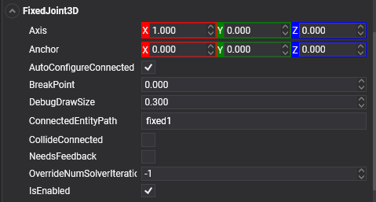

# Fixed Joint

<video autoplay loop muted width="100%" height="auto">
  <source src="images/FixedJointVideo.mp4" type="video/mp4">
</video>

**Fixed Joints** restricts an object’s movement to be dependent upon another object. This is somewhat similar to Parenting but is implemented through physics rather than Transform hierarchy. The best scenarios for using them are when you have objects that you want to easily break apart from each other, or connect two object’s movement without parenting.

## FixedJoint3D

In Evergine, a Fixed Joint is implemented using the `FixedJoint3D` component.




## Properties

| Property | Default | Description |
| --- | --- | --- |
| **ConnectedEntityPath** | null |  The [entity path](../../basics/component_arch/entities/entity_hierarchy.md#entity-paths) of the connected body. Only when the path is valid a Joint is established properly. |
| **Axis** | 1, 0, 0 |  This is the relative axis which locates the joint frame relative to the target body. |
| **Anchor** | 0, 0, 0 | The point which defines the center of the joint in source entity local space. All physics-based simulations use this point as the center in calculations. |
| **AutoConfigureConnected** | true | Enable this setting to automatically calculate the *ConnectedAnchor* position and *ConnectedAxis* to match the global position of the anchor property. This is the default setting. Disable it to configure the position of the connected anchor and connected axis manually. |
| **ConnectedAxis** | *auto-calculated* | The joint axis relative to the connected body. |
| **ConnectedAnchor** | *auto-calculated* | Manually configure the connected anchor position, in the connected body local space. |
| **BreakPoint** | 0 | If the value is greater than 0, Indicates the force that needs to be applied for this joint to break. |
| **CollideConnected** | false | Determines whether a collision between the two bodies managed by the joint is enabled. |

## Using Fixed Joint

This snippet creates two bodies and add a fixed joint maintaining the relative position at start. This is because the `AutoConfigureConnected` property is set to true.

```csharp
protected override void CreateScene()
{
    // Load your material
    var cubeMaterial = this.Managers.AssetSceneManager.Load<Material>(EvergineContent.Materials.CubeMaterial);
    var floorMaterial = this.Managers.AssetSceneManager.Load<Material>(DefaultResourcesIDs.DefaultMaterialID);

    // Create the floor
    var floor = this.CreateFloor(floorMaterial);

    var cubeA = this.CreateCube(cubeMaterial, new Vector3(0, 2, 0), 0.5f);
    var cubeB = this.CreateCube(cubeMaterial, new Vector3(0, 3, 0), 0.5f);

    // Add a Fixed Joint to cubeA...
    cubeA.AddComponent(new FixedJoint3D(){
        ConnectedEntityPath = cubeB.EntityPath // Connect to cubeB
    });

    // Register entities to EntityManager...
    this.Managers.EntityManager.Add(floor);
    this.Managers.EntityManager.Add(cubeA);
    this.Managers.EntityManager.Add(cubeB);
}

private Entity CreateFloor(Material material)
{
    Entity floor = new Entity()
        .AddComponent(new Transform3D())
        .AddComponent(new MaterialComponent() { Material = material })
        .AddComponent(new PlaneMesh() { Width = 10, Height = 10 }) // Create a 10x10 floor plane
        .AddComponent(new MeshRenderer())

        .AddComponent(new StaticBody3D())        // Add a StaticBody component...
        .AddComponent(new BoxCollider3D());     // Add a BoxCollider3D to the physic body...

    return floor;    
}

private Entity CreateCube(Material material, Vector3 position, float size)
{
    Entity cube = new Entity()
        .AddComponent(new Transform3D()
        {
            Position = position
        })
        .AddComponent(new MaterialComponent() { Material = material })
        .AddComponent(new CubeMesh() { Size = size })
        .AddComponent(new MeshRenderer())

        .AddComponent(new RigidBody3D())        // Add a RigidBody3D component...
        .AddComponent(new BoxCollider3D());     // Add a BoxCollider3D to the physic body...

    return cube;
}
```