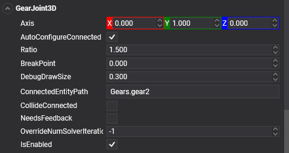

# Gear Joint

<video autoplay loop muted width="100%" height="auto">
  <source src="images/GearJointVideo.mp4" type="video/mp4">
</video>

A **Gear Joint** is a type of constraint that allows you to create a relationship between two rigid bodies that is based on their angular velocities. Specifically, it lets you specify a gear ratio between the angular velocities of the two bodies, which can be used to create realistic mechanical systems like gears, pulleys, and other types of machinery.

## GearJoint3D

In Evergine, a Gear Joint is implemented using the `GearJoint3D` component.




## Properties

| Property | Default | Description |
| --- | --- | --- |
| **ConnectedEntityPath** | null |  The [entity path](../../basics/component_arch/entities/entity_hierarchy.md#entity-paths) of the connected body. Only when the path is valid a Joint is established properly. |
| **Axis** | 0, 1, 0 | The axis rotation of the gear. |
| **Ratio** | 1 | Sets the desired angular speed ratio between the two objects. For example, if you want one object to rotate at half the speed of the other object, set the value of *Ratio* to 0.5.  |
| **BreakPoint** | 0 | If the value is greater than 0, Indicates the force that needs to be applied for this joint to break. |
| **CollideConnected** | false | Determines whether a collision between the two bodies managed by the joint is enabled. |

## Using Gear Joint

This snippet creates 3 gears of different sizes interconnected.

<video autoplay loop muted width="400px" height="auto">
  <source src="images/GearJointSample.mp4" type="video/mp4">
</video>

```csharp
protected override void CreateScene()
{
    this.Managers.RenderManager.DebugLines = true;

    // Load your material
    var material = this.Managers.AssetSceneManager.Load<Material>(DefaultResourcesIDs.DefaultMaterialID);

    float sliderLength = 3;

    // Create the slider holder...
    Entity gear1 = new Entity()
        .AddComponent(new Transform3D())
        .AddComponent(new Spinner() { AxisIncrease = new Vector3(0, 1f, 0) })
        .AddComponent(new MaterialComponent() { Material = material })
        .AddComponent(new CylinderMesh() { Height = 0.1f, Diameter = 2})
        .AddComponent(new MeshRenderer())
        .AddComponent(new RigidBody3D()
        {
            PhysicBodyType = RigidBodyType3D.Kinematic,
            LinearFactor = Vector3.Zero,                   // Lock the object position to avoid gravity fall...
        })
        .AddComponent(new CylinderCollider3D());

    Entity gear2 = new Entity()
        .AddComponent(new Transform3D() { LocalPosition = new Vector3(1.5f, 0, 0) })
        .AddComponent(new MaterialComponent() { Material = material })
        .AddComponent(new CylinderMesh() { Height = 0.1f, Diameter = 1 })
        .AddComponent(new MeshRenderer())
        .AddComponent(new RigidBody3D()
        {
            PhysicBodyType = RigidBodyType3D.Dynamic,
            LinearFactor = Vector3.Zero,                   // Lock the object position to avoid gravity fall...
        })
        .AddComponent(new CylinderCollider3D());

    Entity gear3 = new Entity()
        .AddComponent(new Transform3D() { LocalPosition = new Vector3(-1f, 0.25f, 0), LocalRotation = new Vector3(0, 0, MathHelper.PiOver2) })
        .AddComponent(new MaterialComponent() { Material = material })
        .AddComponent(new CylinderMesh() { Height = 0.1f, Diameter = 0.5f, Tessellation = 8 })
        .AddComponent(new MeshRenderer())
        .AddComponent(new RigidBody3D()
        {
            PhysicBodyType = RigidBodyType3D.Dynamic,
            LinearFactor = Vector3.Zero,                   // Lock the object position to avoid gravity fall...
        })
        .AddComponent(new CylinderCollider3D());

    gear1.AddComponent(new GearJoint3D()
    {
        ConnectedEntityPath = gear2.EntityPath,
        Ratio = 0.5f,
        Axis = Vector3.UnitY,
    });

    gear2.AddComponent(new GearJoint3D()
    {
        ConnectedEntityPath = gear3.EntityPath,
        Ratio = 0.5f,
        Axis = -Vector3.UnitX,
    });

    this.Managers.EntityManager.Add(gear1);
    this.Managers.EntityManager.Add(gear2);
    this.Managers.EntityManager.Add(gear3);
}
```