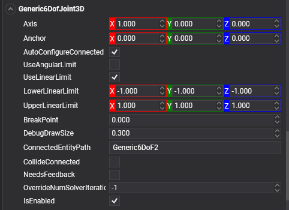

# Generic 6DoF Joint

<video autoplay loop muted width="100%" height="auto">
  <source src="images/Generic6DoFVideo.mp4" type="video/mp4">
</video>

The **Generic 6DoF Joint** can emulate a variety of standard constraints if each of the six Degrees of Freedom (DoF) is configured. The first 3 DoFs axis are linear axis, which represent the translation of rigid bodies, while the latter 3 DoFs axis represent the angular motion. Each axis can be locked, free, or limited. By default, all axes are unlocked.


## Generic6DoFJoint3D

In Evergine, a Generic 6DoF Joint is implemented using the `Generic6DoFJoint3D` component.




## Properties

### Common Properties

| Property | Default | Description |
| --- | --- | --- |
| **ConnectedEntityPath** | null |  The [entity path](../../basics/component_arch/entities/entity_hierarchy.md#entity-paths) of the connected body. Only when the path is valid a Joint is established properly. |
| **Anchor** | 0, 0, 0 | The point which defines the center of the joint in source entity local space. All physics-based simulations use this point as the center in calculations. |
| **AutoConfigureConnected** | true | Enable this setting to automatically calculate the *ConnectedAnchor* position to match the global position of the anchor property. This is the default setting. Disable it to configure the position of the connected anchor manually. |
| **ConnectedAnchor** | *auto-calculated* | Manually configure the connected anchor position, in the connected body local space. |
| **BreakPoint** | 0 | If the value is greater than 0, Indicates the force that needs to be applied for this joint to break. |
| **CollideConnected** | false | Determines whether a collision between the two bodies managed by the joint is enabled. |

### Limit Properties

The following properties set the limits of the object movement.

| Property | Default | Description |
| --- | --- | --- |
| **UseLinearLimit** | false |  If enabled, the position of the connected object will be restricted within the *LowerAngularLimit* & *UpperAngularLimit* values.. |
| **LowerLinearLimit** | 0 |  The lower distance of the limit. |
| **UpperLinearLimit** | 0 |  The upper distance of the limit. |
| **UseAngularLimit** | false |  If enabled, the angular rotations will be restricted within the *LowerAngularLimit* & *UpperAngularLimit* values.. |
| **LowerAngularLimit** | 0 |  The lowest angle the rotation can go. |
| **UpperAngularLimit** | 0 |  The highest  angle the rotation can go. |

## Using Generic 6DoF Joint

This snippet uses a Generic6DoF to replicate the same functionality showed in the [Slider Joint example](slider_joint.md#using-slider-joint).

<video autoplay loop muted width="400px" height="auto">
  <source src="images/Generic6DoFSample.mp4" type="video/mp4">
</video>

```csharp
protected override void CreateScene()
{
    this.Managers.RenderManager.DebugLines = true;

    // Load your material
    var material = this.Managers.AssetSceneManager.Load<Material>(DefaultResourcesIDs.DefaultMaterialID);
    var cubeMaterial = this.Managers.AssetSceneManager.Load<Material>(EvergineContent.CrateMat);

    float sliderLength = 3;

    // Create the slider holder...
    Entity slider = new Entity()
        .AddComponent(new Transform3D()
        {
            Scale = new Vector3(sliderLength, 0.1f, 0.1f),
            Rotation = new Vector3(0, 0, MathHelper.ToRadians(-10))   // Rotate 10º the slider axis
        })
        .AddComponent(new MaterialComponent() { Material = material })
        .AddComponent(new CubeMesh())
        .AddComponent(new MeshRenderer())
        .AddComponent(new RigidBody3D()
        {
            PhysicBodyType = RigidBodyType3D.Kinematic
        });

    // Create the sliding object...
    Entity cube = new Entity()
        .AddComponent(new Transform3D())
        .AddComponent(new MaterialComponent() { Material = cubeMaterial })
        .AddComponent(new CubeMesh() { Size = 0.5f })
        .AddComponent(new MeshRenderer())
        .AddComponent(new RigidBody3D()
        {
            PhysicBodyType = RigidBodyType3D.Dynamic,
        });

    // Create the Joint
    slider.AddComponent(new Generic6DofJoint3D()
    {
        ConnectedEntityPath = cube.EntityPath,
        UseLinearLimit = true,                  // Limit the slider
        LowerLinearLimit = new Vector3(0, 0, -sliderLength / 2),
        UpperLinearLimit = new Vector3(0, 0, sliderLength / 2),
    });

    this.Managers.EntityManager.Add(slider);
    this.Managers.EntityManager.Add(cube);
}
```