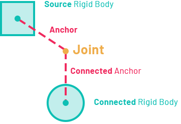
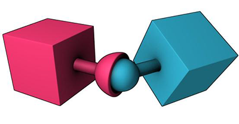

# Joints
---

<video autoplay loop muted width="100%" height="auto">
  <source src="images/joints.mp4" type="video/mp4">
</video>

A **Joint** constrains the way two RigidBodies move relative to one another. A typical use for a joint would be to model a door hinge or the shoulder of a character.

Evergine has a set of default joint types (point to point, hinge, etc...) that allows developers to make many different types of constraints simply by changing some properties.

## Joints and RigidBodies

In Evergine you can create Joints by adding the proper component (`HingeJoint3D` for example) to an Entity that contains a [RigidBody3D](../physics_bodies/rigid_bodies.md) component. This body is treated as *Source Rigid Body*. A Joint always need to be connected to another RigidBody, which is named *Connected Rigid Body*.

### Joint Anchor

The position offset of the joint respect the Source RigidBody is called **Anchor**. The offset position respect the connected Rigid Body is the **Connected Anchor**.

### Breaking joints

You can use the BreakPoint properties to set limits for the joint's strength. If these are greater than 0, and a force greater than these limits are applied to the object, the joint will be destroyed and will no longer be confined by its restraints.

## Supported Joint types

| Joint | Description |
| --- | --- |
| **[Fixed Joint](fixed_joint.md)** | **Fixed Joints** restricts an object’s movement to be dependent upon another object.  This is somewhat similar to a parent entity but is implemented through physics rather than Entity hierarchy. The best scenarios for using them are when you have objects that you want to easily break apart from each other, or connect two object’s movement without parenting. |
| **[Point-to-Point Joint](point_to_point_joint.md)** |  The **Point-to-Point Joint** limits the translation so that pivot points between the two rigid bodies match in world space. You can use the Point to Point joint to create effects, such as a chain-link, or to pin objects together. |
| **[Hinge Joint](hinge_joint.md)** |  The **Hinge Joint** restricts the translation and two additional angular degrees of freedom, so the body can only rotate around one defined axis. This joint is useful for representing doors or wheels rotating around an axis. The user can specify limits and motor settings for the hinge. |
| **[Slider Joint](slider_joint.md)** |  The **Slider Joint** allows rigid bodies to rotate around one axis and translate along the same axis. |
| **[Cone Twist Joint](cone_twist_joint.md)** | For ragdolls, the **Cone-Twist Joint** is useful for limbs like the upper arm. It is a special point-to-point joint that adds cone and twist axis limits. |
| **[Gear Joint](gear_joint.md)** | A **Gear Joint** is a type of constraint that allows you to create a relationship between two rigid bodies that is based on their angular velocities. Specifically, it lets you specify a gear ratio between the angular velocities of the two bodies, which can be used to create realistic mechanical systems like gears, pulleys, and other types of machinery. |
| **[Generic 6DoF Joint](generic_6dof_joint.md)** |  The **Six Degrees-Of-Freedom Joint** can emulate a variety of standard constraints if each of the six Degrees of Freedom (DoF) is configured. The first 3 DoFs axis are linear axis, which represent the translation of rigid bodies, while the latter 3 DoFs axis represent the angular motion. Each axis can be locked, free, or limited. By default, all axes are unlocked. |
| **[Spring Joint](spring_joint.md)** |  The **Spring Joint** is a variant of the previous Six Degrees-of-Freedom joint that includes the addition of springs for each of the degrees of freedom. Springs and motors cannot be combined on this constraint. |

## In this section
* [Fixed Joint](fixed_joint.md)
* [Point to Point Joint](point_to_point_joint.md)
* [Hinge Joint](hinge_joint.md)
* [Slider Joint](slider_joint.md)
* [Cone Twist Joint](cone_twist_joint.md)
* [Gear Joint](gear_joint.md)
* [Generic 6DoF Joint](generic_6dof_joint.md)
* [Spring Joint](spring_joint.md)