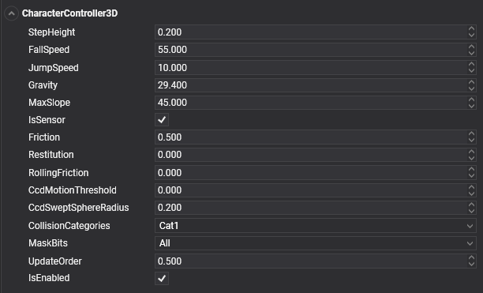

# Character Controller


The character controller is an physic body type used for the player objects to provide collision-based physics but also to allow for more customizations dedicated to game characters (player or NPCs). It's a common choice for first-person and third-person games.


In Evergine, we use the `CharacterController3D` component to provide this functionality.

## CharacterController3D Component



### General properties

| Property | Default | Description |
| --- | --- | --- |
| **Restitution**| 0 | Sets the amount of kinetic energy lost or gained after a collision. A typical value is between 0 and 1. If the restitution property of colliding bodies is 0, the bodies lose all energy and stop moving immediately on impact. If the restitution is 1, they lose no energy and rebound with the same velocity they collided at. Use this to change the "bounciness" of rigidbodies. | 
| **Friction**| 0.5 | Sets the surface friction. | 
| **RollingFriction**| 0 | Sets the rolling friction. | 
| **IsSensor** | true | Characters are special type of physics bodies and by default is created as a sensor. |
| **CollisionCategory**| `Cat1` | The CollisionCategory flag specify the category of this body. | 
| **MaskBit**| `All` | The MaskBits indicates with which categories this body will collide. |

### Character properties

The following properties affect the movement of the rigidbody.

| Property | Default | Description |
| --- | --- | --- |
| **StepHeight** | 0.2 | The maximum height the character can step onto. |
| **FallSpeed** | 55 | Maximum velocity of a character in a free fall (m/s). By default is 55, the terminal velocity of a sky diver. |
| **JumpSpeed** | 10 | Jump speed. |
| **MaxSlope** | 45 | Limits the character to only climb slopes that are less steep (in degrees) than the indicated value. |
| **Gravity** | 29.4 | 3G gravity acceleration. |

### Useful methods

To control a character, you may find useful these methods:

| Method | Description | 
 | --- | --- |
 | **SetVelocity(velocity)** |  Sets the character velocity. This is the most usual way to move and control a character. After setting a velocity vector, the character will move in that direction, and will interact with the physic world. |
 | **Jump(), Jump(jumpDirection)** | The character perform a jump movement. You can specify an optional jump direction. |
 | **Teleport(newPosition)** | Teleport the character to a new position. |

## Create a Character Controller

### From code

This code is just to create a character body:
```csharp

Entity character = new Entity()
    .AddComponent(new Transform3D(){ Position = characterPosition })
    .AddComponent(new MaterialComponent() { Material = material }) // assign a material
    .AddComponent(new CapsuleMesh())
    .AddComponent(new MeshRenderer())
    
    .AddComponent(new CharacterController())    // Add a RigidBody3D component...
    .AddComponent(new CapsuleCollider3D());     // Assign a CapsuleCollider3D to the physic body...

    .AddComponent(new MoveCharacterBehavior())  // Add a component that will control the character.

this.Managers.EntityManager.Add(character);
```

But we need a component that move the `CharacterController3D` component. The following component just capture some keys to move and jump the character.

```csharp
public class MoveCharacterBehavior : Behavior
{
    [BindComponent]
    private CharacterController3D character;

    public float Speed { get; set; } = 3;

    protected override void Update(TimeSpan gameTime)
    {
        // Gets the keyboard
        var keyboard = this.Managers.RenderManager.ActiveCamera3D.Display.KeyboardDispatcher;

        // Use keys (I, K, J, L) to move the character...
        var velocity = Vector3.Zero;
        if (keyboard.IsKeyDown(Evergine.Common.Input.Keyboard.Keys.I)) { velocity += Vector3.Forward; }
        if (keyboard.IsKeyDown(Evergine.Common.Input.Keyboard.Keys.K)) { velocity += Vector3.Backward; }
        if (keyboard.IsKeyDown(Evergine.Common.Input.Keyboard.Keys.J)) { velocity += Vector3.Left; }
        if (keyboard.IsKeyDown(Evergine.Common.Input.Keyboard.Keys.L)) { velocity += Vector3.Right; }

        // Update the character velocity...
        this.character.SetVelocity(velocity * this.Speed);

        // Jump if we press the space key...
        if (keyboard.IsKeyDown(Evergine.Common.Input.Keyboard.Keys.Space)) { this.character.Jump(); }
    }
```