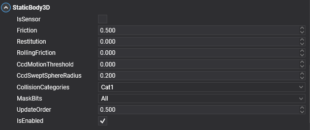

# Static Bodies


**Static bodies** are not affected by any physic force, and as a result it don't move. Rigid bodies can collide with static bodies. In general, static bodies can be used for objects that are immovable, like walls, floors, etc...


In Evergine, we use the `StaticBody3D` component to provide the functionality required to turn an Entity into a Static body.

> [!Note]
> You can change the position of a static body changing the entity Transform, but it is not recommended if you want to apply motions. In that case use a Kinematic RigidBody

## Static Component

In Evergine, we use the `StaticBody3D` component to provide the functionality required to turn an Entity into a Static body.



### General properties

| Property | Default | Description |
| --- | --- | --- |
| **Restitution**| 0 | Sets the amount of kinetic energy lost or gained after a collision. A typical value is between 0 and 1. If the restitution property of colliding bodies is 0, the bodies lose all energy and stop moving immediately on impact. If the restitution is 1, they lose no energy and rebound with the same velocity they collided at. Use this to change the "bounciness" of rigidbodies. | 
| **Friction**| 0.5 | Sets the surface friction. | 
| **RollingFriction**| 0 | Sets the rolling friction. |
| **IsSensor** | false | If you set a physic body to be a sensor, other colliders no longer bump into it. Instead, they pass through. Sensors detects when bodies enter it, which you can use in your application. |
| **CollisionCategory**| `Cat1` | The CollisionCategory flag specify the category of this body. | 
| **MaskBit**| `All` | The MaskBits indicates with which categories this body will collide. |

## Create a Static Body

You only need to add a `StaticBody3D` to an entity, to become this into a static body. Don't forget to add a proper collider too.

### From code

In the following code we will create a floor plane of 10x10 units:

```csharp

Entity floor = new Entity()
    .AddComponent(new Transform3D(){ Position = position })
    .AddComponent(new MaterialComponent() { Material = floorMaterial }) // assign a material
    .AddComponent(new PlaneMesh(){ Width = 10, Height = 10 }) // Create a 10x10 floor plane
    .AddComponent(new MeshRenderer())

    .AddComponent(new StaticBody3D())         // Add a StaticBody3D component...    
    .AddComponent(new BoxCollider3D());     // Assign a BoxCollider3D to the physic body...

this.Managers.EntityManager.Add(floor);
```