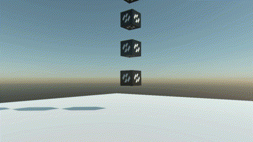
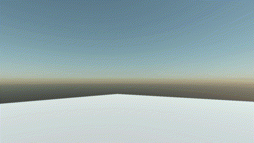

# Using Physics Bodies

This is a small step by step to cover a variety of physics bodies. This is easily to replicate in Evergine Studio.

## 1. Create a pile of rigid bodies

In the following example we will create a simple pile of 10 rigid bodies and a static body as a floor:



```csharp
protected override void CreateScene()
{
    // Load your material
    var cubeMaterial = this.Managers.AssetSceneManager.Load<Material>(EvergineContent.Materials.CubeMaterial);
    var floorMaterial = this.Managers.AssetSceneManager.Load<Material>(DefaultResourcesIDs.DefaultMaterialID);

    // Create the floor
    this.CreateFloor(floorMaterial);

    // Create 10 cubes
    for (int i = 0; i < 10; i++)
    {
        this.SpawnCube(cubeMaterial, new Vector3(0, 1 + i, 0), 0.5f);
    }
}

private void CreateFloor(Material material)
{
    Entity cube = new Entity()
        .AddComponent(new Transform3D())
        .AddComponent(new MaterialComponent() { Material = material })
        .AddComponent(new PlaneMesh() { Width = 10, Height = 10 }) // Create a 10x10 floor plane
        .AddComponent(new MeshRenderer())

        .AddComponent(new StaticBody3D())        // Add a StaticBody component...
        .AddComponent(new BoxCollider3D());     // Add a BoxCollider3D to the physic body...

    this.Managers.EntityManager.Add(cube);
}

private void SpawnCube(Material material, Vector3 position, float size)
{
    Entity cube = new Entity()
        .AddComponent(new Transform3D()
        {
            Position = position
        })
        .AddComponent(new MaterialComponent() { Material = material })
        .AddComponent(new CubeMesh() { Size = size })
        .AddComponent(new MeshRenderer())

        .AddComponent(new RigidBody3D())        // Add a RigidBody3D component...
        .AddComponent(new BoxCollider3D());     // Add a BoxCollider3D to the physic body...

    this.Managers.EntityManager.Add(cube);
}
```

## 2. Adding a Kinematic body

In this step we will add a kinematic body to the scene and we are going to add a simple shake movement:



Add the following code to your scene:

```csharp
 protected override void CreateScene()
{
    // Previous code of step 1...    

    // Create a kinematic body
    this.CreateKinematic();
}

private void CreateKinematic()
{
    // Load your material
    var material = this.Managers.AssetSceneManager.Load<Material>(EvergineContent.Materials.Kinematic);

    Entity cube = new Entity()
        .AddComponent(new Transform3D()
        {
            Position = new Vector3(0, 0.5f, 0)
        })
        .AddComponent(new MaterialComponent() { Material = material })
        .AddComponent(new CubeMesh() { Size = 1 })
        .AddComponent(new MeshRenderer())

        .AddComponent(new RigidBody3D()         // Add a RigidBody3D component...
        {
            PhysicBodyType = RigidBodyType3D.Kinematic  // Kinematic rigid body...
        })
        .AddComponent(new BoxCollider3D())     // Add a BoxCollider3D to the physic body...        
        .AddComponent(new ShakeKinematic());   // Add a behavior that move this entity...

    this.Managers.EntityManager.Add(cube);
}

```

This is the `ShakeKinematic` component, that move the entity:

```csharp
public class ShakeKinematic : Behavior
{
    [BindComponent]
    public Transform3D transform;

    [BindService]
    public Clock clock;

    private Vector3 initPosition;

    protected override void Start()
    {
        base.Start();
        this.initPosition = this.transform.Position;
    }

    protected override void Update(TimeSpan gameTime)
    {
        this.transform.Position = initPosition + new Vector3((float)Math.Cos(5 * clock.TotalTime.TotalSeconds), 0, 0);
    }
}
```