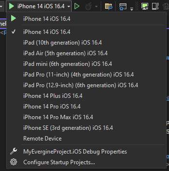
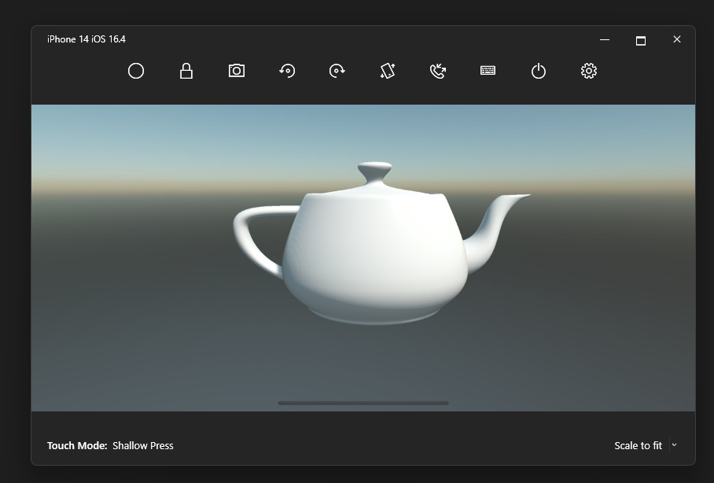

# iOS Platform


Recently, Evergine can deploy applications on iOS devices. This is possible due to the _Metal API_ integration and the excellent work done in _.NET 8_.

## Create a New Application

Use the Evergine launcher to add iOS as one of your project's platforms. The current iOS template runs with _.NET 8.0 for iOS_. This template will create all the necessary code to allow your application to be deployed on iOS devices.


### Prerequisites

#### Visual Studio for Windows

Currently, the iOS template for Evergine is designed to be opened in **Visual Studio for Windows**, and if you open that solution on a Mac, it won't compile properly.

However, if you want to finally deploy your solution on an iOS device (iPhone or iPad) or iOS Simulator, you need to pair your Visual Studio with a Mac. You can find useful information [here](https://learn.microsoft.com/en-us/dotnet/maui/ios/pair-to-mac).

#### iOS Workload

To compile and deploy iOS projects using Evergine, you should install the iOS workload for _.NET 8.0_. You can do this using a PowerShell console:

```powershell
dotnet workload install ios
```

## Project Structure

The project structure created when you add an iOS template is as follows:


It will add a project with the `net8.0-ios` target framework. It creates an Evergine view embedded in a storyboard. You can create your own native iOS user interface and integrate it with Evergine 3D applications.

## Application Deployment

As we mentioned before, to deploy your Evergine application, you will need to pair your Visual Studio with a Mac. [Here](https://learn.microsoft.com/en-us/dotnet/maui/ios/pair-to-mac) you can find detailed information about this, but here are the main steps required:

1. Once your Evergine iOS project is open in Visual Studio, press the **Pair to Mac** button: 
2. The **Pair to Mac** dialog displays a list of Mac build hosts. Select one from the list and press **Connect**. You may be required to enter credentials to connect to the selected machine.
   

### Deploy to iOS Simulator

Once your Visual Studio is connected to a Mac, you can select one of the available simulators listed in the Run button:


Once the application is deployed, Visual Studio will launch the iOS Simulator on your Windows desktop, allowing you to debug and control your Evergine application.



### Deploy to iOS Device

Running on an iOS device will require setting up your iOS project. [Here](https://learn.microsoft.com/en-us/xamarin/ios/get-started/installation/device-provisioning/) you can find useful information about how to prepare your iOS project to be deployed.

Once you have properly set up your application, you can select one of the available devices in Visual Studio and run your application on it.