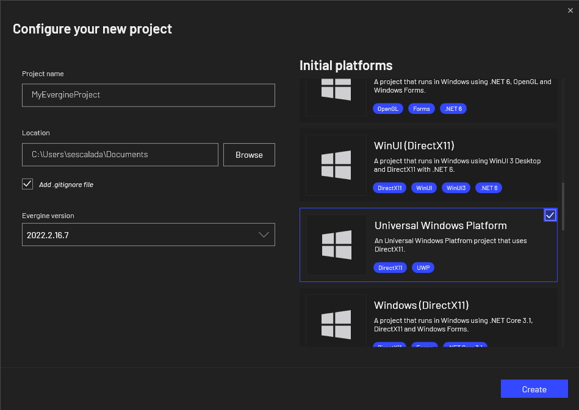

# UWP Platform

> [!WARNING]
> The UWP platform in Evergine is now deprecated and could be removed in future releases.

## Desktop and Tablets

You can add _UWP_ as one of the platforms for your project using the _Universal Windows Platform_ template. With this template, you can create an application that runs on devices such as PCs, tablets, or Xbox.

The project targets _Windows 10_ build _16299_ as the minimum version, and _Windows 10_ build _18362_ as the target version.

You can also deploy applications to _HoloLens_ devices, as stated in the [Mixed Reality](#Mixed-Reality) section.

### Prerequisites
You must install the target SDKs to build and run the application. You can find download links [here](https://developer.microsoft.com/en-us/windows/downloads/sdk-archive).

### Application Deployment
As a standard _UWP_ application, you can deploy your application on your local Windows device, a remote device, or a physical device connected by _USB_ to your development machine.

## Mixed Reality

If you want to create an Evergine project for _HoloLens_, you should use the _Mixed Reality_ template.

The project targets _Windows 10_ build _16299_ as the minimum version, and _Windows 10_ build _18362_ as the target version.

### XR Capabilities
Evergine for _Mixed Reality_ relies on a set of interfaces and classes defined in the _Evergine.Framework.XR.*_ namespace:
- QR code detection with [IQRCodeWatcherService](xref:Evergine.Framework.XR.QR.IQRCodeWatcherService). 
- Spatial anchors with [SpatialAnchor](xref:Evergine.Framework.XR.SpatialAnchors.SpatialAnchor).
- Spatial mapping with [SpatialMappingObserver](xref:Evergine.Framework.XR.SpatialMapping.SpatialMappingObserver) and [SpatialMappingSurface](xref:Evergine.Framework.XR.SpatialMapping.SpatialMappingSurface).

### Application Deployment
In this case, there are two options for application deployment: 
- Deploy in the _HoloLens_ emulator: Before deploying, you need to install the device emulator from the [official documentation](https://docs.microsoft.com/en-us/windows/mixed-reality/develop/advanced-concepts/hololens-emulator-archive) page.
- Deploy on a _HoloLens_ device: Remember that you should mark _ARM64_ as the active configuration to deploy an application for _HoloLens 2_. For more information, read the [official documentation](https://docs.microsoft.com/en-us/windows/mixed-reality/develop/advanced-concepts/using-visual-studio?tabs=hl2).