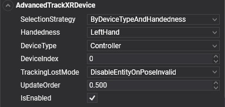

# AdvancedTrackXRDevice

This component allows you to track **all kind of XR Devices**, not only controllers or hands, such as base stations, generic trackers, etc...



## Selection Strategy

This component can select the device that will track in different ways, and it is defined by the `SelectionStrategy` property, that has the following values:
* **ByHandedness:** Specify the device using the handedness (left or right device). This is the most usual way to select a device. 
* **ByDeviceType:** Select the device by specifying the type of the device and an number of occurrences.
* **ByDeviceTypeAndHandedness:** Select the device by specifying the type of the device and the handedness.
* **ByDeviceIndex:** The InputTracking maintain an ordered list of tracked devices. If you use this way the device will be selected by specifying an index on that list.

### Selection by Handedness
If your selection strategy is `ByHandedness`, you will select your device by using its handedness. In that case you need to se these properties:

| Property | Description |
| --- | --- |
| **Handedness** | With this property you will indicate the handedness of the device that you want to track: <ul><li>`LeftHand` to specify the left hand.</li><li>`RightHand` to specify the right hand.</li><li>`Undefined` if the device has no specific handedness.</li></ul> |
| **DeviceIndex** | In the case that there are more than one devices using the same handedness, with this property you will specify which occurence are going to be selected. |

### Selection by Device Type
If your selection strategy is `ByDeviceType`, you will select your device by using its handedness. In that case you need to se these properties:

| Property | Description |
| --- | --- |
| **DeviceType** | Specify the type of device that you want to select: <ul><li>`Controller` if you want to select a tipical controller device.</li><li>`HMD` in the case that you want to track the headset device.</li><li>`GenericTracker` to select typical tracker devices (such as Vive Tracker).</li><li>`TrackingReference` reffers to devices used as a tracking reference (such as Vive Base Stations or old Oculus Rift Camera Sensors).</li><li>`Hand` if the system can detect the user hands.</li></ul> |
| **DeviceIndex** | In the case that there are more than one devices using the same device type, with this property you will specify which occurence are going to be selected. |

### Selection by Device Type and Handedness
If your selection strategy is `ByDeviceTypeAndHandedness`, you will select your device by using its handedness and the specified device type. In that case you need to se these properties:

| Property | Description |
| --- | --- |
| **DeviceType** | Specify the type of device that you want to select: <ul><li>`Controller` if you want to select a tipical controller device.</li><li>`HMD` in the case that you want to track the headset device.</li><li>`GenericTracker` to select typical tracker devices (such as Vive Tracker).</li><li>`TrackingReference` reffers to devices used as a tracking reference (such as Vive Base Stations or old Oculus Rift Camera Sensors).</li><li>`Hand` if the system can detect the user hands.</li></ul> |
| **Handedness** | With this property you will indicate the handedness of the device that you want to track: <ul><li>`LeftHand` to specify the left hand.</li><li>`RightHand` to specify the right hand.</li><li>`Undefined` if the device has no specific handedness.</li></ul> |
| **DeviceIndex** | In the case that there are more than one devices using the same properties described above, with this property you will specify which occurence are going to be selected. |

### Selection by Device Index
If your selection strategy is `ByDeviceIndex`, you will select your device by its index that is registered in your system.

| Property | Description |
| --- | --- |
| **DeviceIndex** | Integer that specify the index of the device. |

## Tracking lost mode

This component will updat the entity Transform to follow the selected device. But in the case that an issue occurs during the tracking  process, you can specify how the entity behaves using the following property:

| Property | Description |
| --- | --- |
| **TrackingLostMode** | Specify the strategy to follow in case that the device is not well tracked: <ul><li>`DisableEntityOnPoseInvalid` disable the entity if the tracked pose is not valid. In the case that the device is well tracked again, the entity will be enabled again. *This is the default value.*</li><li>`KeepLastPose` stop to track the entity if the pose is not valid, maintaining the entity with the last pose received.</li><li>`DisableEntityOnDisconnection` disable the entity only if the selected device is no longer connected.</li></ul> |

## Using AdvancedTrackXRDevice

In the following code you will find how to create some sort of entities to track left and right controllers, and two generic trackers:

```csharp
    protected override void CreateScene()
    {
        base.CreateScene();

        // Left entity
        var leftDevice = new Entity()
            .AddComponent(new Transform3D())
            .AddComponent(new AdvancedTrackXRDevice()
            {
                SelectionStrategy = TrackXRDevice.SelectionDeviceStrategy.ByDeviceTypeAndHandedness,
                DeviceType = XRTrackedDeviceType.Controller,
                Handedness = XRHandedness.RightHand // select the left device
            });

        // Right entity
        var rightDevice = new Entity()
            .AddComponent(new Transform3D())
            .AddComponent(new AdvancedTrackXRDevice()
            {
                SelectionStrategy = TrackXRDevice.SelectionDeviceStrategy.ByDeviceTypeAndHandedness,
                DeviceType = XRTrackedDeviceType.Controller,
                Handedness = XR.XRHandedness.RightHand // select the right device
            });

        this.Managers.EntityManager.Add(leftDevice);
        this.Managers.EntityManager.Add(rightDevice);

        // First Tracker 
        var firstTracker = new Entity()
            .AddComponent(new Transform3D())
            .AddComponent(new AdvancedTrackXRDevice()
            {
                SelectionStrategy = TrackXRDevice.SelectionDeviceStrategy.ByDeviceType,
                DeviceType = XRTrackedDeviceType.GenericTracker,
                DeviceIndex = 0 // First                
            });

        // Second Tracker 
        var secondTracker = new Entity()
            .AddComponent(new Transform3D())
            .AddComponent(new AdvancedTrackXRDevice()
            {
                SelectionStrategy = TrackXRDevice.SelectionDeviceStrategy.ByDeviceType,
                DeviceType = XRTrackedDeviceType.GenericTracker,
                DeviceIndex = 1 // Second                
            });

        this.Managers.EntityManager.Add(firstTracker);
        this.Managers.EntityManager.Add(secondTracker);
    }
```