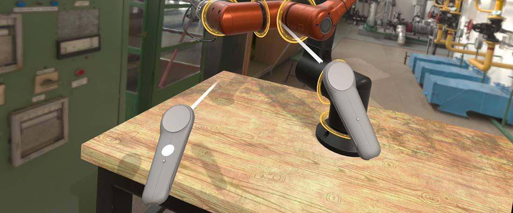

# XR Input Tracking

In XR, it's usual for the user to interact with different XR input devices such as Motion Controllers, Hands, Trackers, etc.

The InputTracking subsystem of XRPlatform keeps control and tracks all connected devices in the XR session. Using `XRPlatform.InputTracking`, you can list all connected devices in your system and access their information.

However, it is more straightforward to use components that help developers integrate the device tracking status into their entities and components.

## Track XR Components
The following components will change the entity Transform by setting the device position and orientation:

* **TrackXRController:** Represents and tracks a typical motion controller. This component inherits from `TrackXRDevice` and additionally exposes the state of its buttons, triggers, and much more.
* **TrackXRArticulatedHand:** If your XR system has hand-tracking support, it provides access to the articulated hand's state. Additionally, it exposes a list of hand joint poses.
* **AdvancedTrackXRDevice:** This component allows you to track all kinds of XR devices, such as base stations, generic trackers, etc.

## In this section
- [Tracking Controllers (TrackXRController)](trackxrcontroller.md)
- [Tracking Hands (TrackXRArticulatedHand)](trackxrarticulatedhand.md)
- [Advanced Tracking Devices (AdvancedTrackXRDevice)](advancedtrackxrdevice.md)
