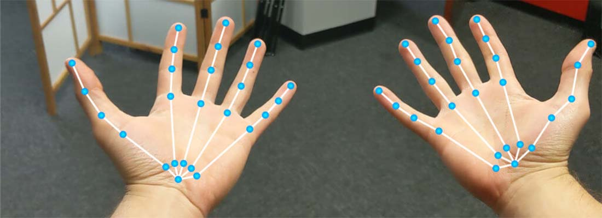

# TrackXRArticulatedHand



This component is used to track and obtain the state of an articulated hand. A variety of MR and VR platforms supports hand tracking, like Mixed Reality (HoloLens) or Oculus Quest.

## Supported Hand Joints

Evergine supports a list of hand joints to be tracked, it is described using the `XRHandJointKind` enumeration, and its values can be visually perceived in the following image:


> [!Note]
> The entity transform will use the `Palm` joint pose.


## Properties

The following properties has been added to this component in order to acces hand joint information:

| Property | Description |
| --- | --- |
| **Handedness** | With this property you will indicate the handedness of the device that you want to track: <ul><li>`LeftHand` to specify the left hand.</li><li>`RightHand` to specify the right hand.</li><li>`Undefined` if the device has no specific handedness.</li></ul> |
| **TrackingLostMode** | Specify the strategy to follow in case that the device is not well tracked: <ul><li>`DisableEntityOnPoseInvalid` disable the entity if the tracked pose is not valid. In the case that the device is well tracked again, the entity will be enabled again. *This is the default value.*</li><li>`KeepLastPose` stop to track the entity if the pose is not valid, maintaining the entity with the last pose received.</li><li>`DisableEntityOnDisconnection` disable the entity only if the selected device is no longer connected.</li></ul> |
| **SupportedHandJointKind** | Returns a `XRHandJointKind[]` array of supported hand joints. Hand tracking in some devices can be limited and only support a limited joints |
| **TryGetArticulatedHandJoint()** | Obtains the articulated hand joint state specified using a `XRHandJointKind` value. Return true if the joint is susscessfully obtained. |

## Using TrackXRArticulatedHand

### Create a TrackXRArticulatedHand from code
In the following code you will find how to create an entity that track a controller from code:

```csharp
protected override void CreateScene()
{
    base.CreateScene();

    var material = this.Managers.AssetSceneManager
        .Load<Material>(EvergineContneet.DefaultMaterialID); // The hand material

    // Hand entity
    var leftHand = new Entity()
        .AddComponent(new Transform3D())
        .AddComponent(new MaterialComponent() { Material = material })
        .AddComponent(new TeapotMesh() { Size = 0.15f })
        .AddComponent(new MeshRenderer())
        .AddComponent(new TrackXRArticulatedHand()
        {
            Handedness = XRHandedness.LeftHand // select the left hand
        })
        .AddComponent(new DebugArticulatedhand());

    this.Managers.EntityManager.Add(leftHand);
}
```

### Read the Hand Joints

Small sample to read the hand joint state:

```csharp
public class DebugArticulatedhand : Behavior
{
    [BindComponent]
    private TrackXRArticulatedHand trackXRHand;

    protected override void Update(TimeSpan gameTime)
    {
        var lineBatch = this.Managers.RenderManager.LineBatch3D;
        if (trackXRHand.IsConnected)
        {
            // Iterate over all supported joints
            foreach (var supportedJoint in this.trackXRHand.SupportedHandJointKind)
            {
                // Obtain the joint pose and draw it...
                if (this.trackXRHand.TryGetArticulatedHandJoint(supportedJoint, out var handJoint))
                {
                    Matrix4x4.CreateFromTR(ref handJoint.Pose.Position, ref handJoint.Pose.Orientation, out var jointTransform);
                    lineBatch.DrawAxis(jointTransform, 0.01f); // Draw 1cm axis with the joint transform
                }
            }
        }
    }
}
```


### Render Hands

Using the `XRDeviceRenderableModel` component add the possibility to obatains a renderable model associated to XR device. In the case of articulated hands, it provides a skinned mesh of the hand following the user hand poses.

> [!Note]
> You can add to the entity an optional `MaterialComponent` component, to specify which material will be used to render the hand meshes. If this component is not provided, they will be rendered by the default material.

<video width="512" height="512" autoplay loop>
  <source src="images/renderhandsvideo.mp4" type="video/mp4">
</video>

#### Render Hands from code

Small example that shows how to render both hands using the `XRDeviceRenderableModel` component.

```csharp
protected override void CreateScene()
{
    base.CreateScene();

    var material = this.Managers.AssetSceneManager
        .Load<Material>(EvergineContneet.DefaultMaterialID); // The hand material

    // Left hand
    var leftHand = new Entity()
        .AddComponent(new Transform3D())
        .AddComponent(new MaterialComponent() { Material = material })            
        .AddComponent(new TrackXRArticulatedHand()
        {
            Handedness = XRHandedness.LeftHand // select the left hand
        })
        .AddComponent(new XRDeviceRenderableModel());

    this.Managers.EntityManager.Add(leftHand);

    // Right hand
    var rightHand = new Entity()
        .AddComponent(new Transform3D())
        .AddComponent(new MaterialComponent() { Material = material })            
        .AddComponent(new TrackXRArticulatedHand()
        {
            Handedness = XRHandedness.RightHand // select the right hand
        })
        .AddComponent(new XRDeviceRenderableModel());

    this.Managers.EntityManager.Add(rightHand);
}
```