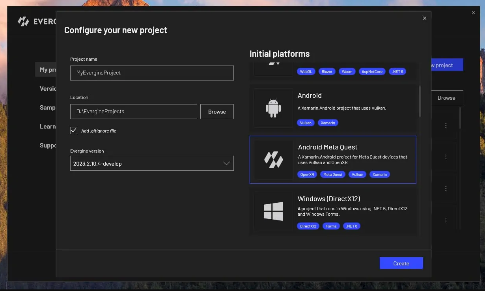

# OpenXR

**OpenXR** is an open royalty-free API standard from [Khronos](https://www.khronos.org/openxr/), designed to unify the development across multiple VR/MR/AR (XR) devices. 

Behind this initiative, there are companies like Meta, Microsoft, HTC, Steam, Varjo, and Magic Leap, allowing support to all their devices.

The official support for OpenXR will allow the Evergine developer to create new applications that will support the incoming new XR devices.

In this Evergine version, the OpenXR integration covers the main aspects of this standard. We will provide new functionality and specific extensions in future versions, such as eye gazing, and Spatial Mapping, which are very useful in HoloLens devices.

Right now, Evergine allows you to create PC desktop applications with Evergine that cover almost the entire variety of wired VR devices and portable Android devices (such as Meta Quest).

## OpenXRPlatform

The OpenXR implementation is provided by the `OpenXRPlatform` service, this class offer the implementation of [XRPlatform](../xrplatform.md).
When you create the OpenXRPlatform instance, you have the possibility to specify which extensions do you want to enable.

## Meta Quest project template

The Oculus Quest device is now called Meta Quest after the latest news from Facebook. This is the most popular VR headset right now after selling about 10 million units of the newest Quest 2 device.

Thanks to the OpenXR standard, the latest Evergine version brings the possibility to deploy your VR applications into Meta Quest devices.

For maximum performance and to support future graphics features, we use Vulkan as the only Graphics API in this platform based on Android.

### Create a Meta Quest template

To start developing your Evergine project with Meta Quest, you only need to select the Android Meta Quest template when you create an Evergine project:

On the other hand, if you have previously created an Evergine project, you can add the Meta Quest profile in the Project Settings:

