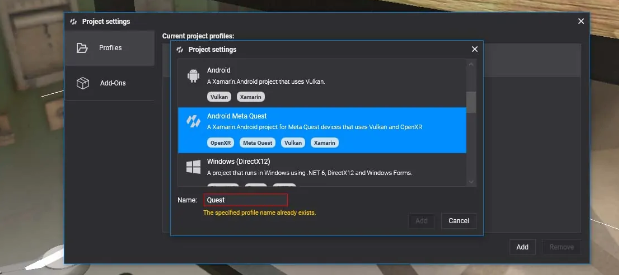

# OpenXR

**OpenXR** is an open, royalty-free API standard from [Khronos](https://www.khronos.org/openxr/) designed to unify development across multiple VR/MR/AR (XR) devices.

This initiative is supported by companies like Meta, Microsoft, HTC, Steam, Varjo, and Magic Leap, enabling compatibility across all their devices.

Official support for OpenXR will allow Evergine developers to create new applications that will support upcoming XR devices.

In this version of Evergine, OpenXR integration covers the main aspects of this standard. We will provide new functionality and specific extensions in future versions, such as eye tracking and spatial mapping, which are particularly useful for HoloLens devices.

Currently, Evergine allows you to create PC desktop applications that cover almost the entire spectrum of wired VR devices and portable Android devices (such as Meta Quest).

## OpenXRPlatform

The OpenXR implementation is provided by the `OpenXRPlatform` service, a class that offers the implementation of [XRPlatform](../xrplatform.md). When you create an `OpenXRPlatform` instance, you have the option to specify which extensions you want to enable.

## Meta Quest Project Template

The Oculus Quest device is now called Meta Quest following the latest announcement from Facebook. This is the most popular VR headset currently, with about 10 million units of the newest Quest 2 device sold.

Thanks to the OpenXR standard, the latest version of Evergine allows you to deploy your VR applications on Meta Quest devices.

For maximum performance and to support future graphics features, we use Vulkan as the only Graphics API on this Android-based platform.

### Create a Meta Quest Template

To start developing your Evergine project with Meta Quest, simply select the Android Meta Quest template when creating an Evergine project:

Alternatively, if you have already created an Evergine project, you can add the Meta Quest profile in the Project Settings:

