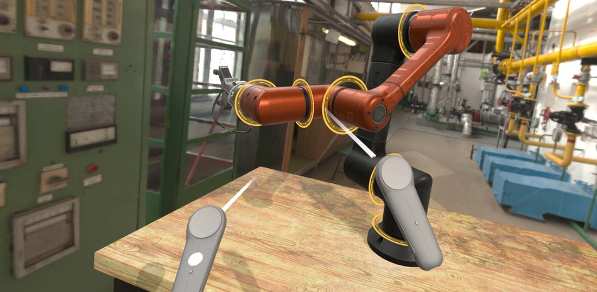

# XR Platform

**XRPlatform** is the main service in Evergine to provide XR functionality to your applications.
 This service (through its implementations) is responsible to:
 - Create and maintain the XR session.
 - Create and maintain all required graphic resources to properly render the scene in the XR environment.
 - Update the scene Camera to track the HMD device.
 - Offer access to different XR subsystems (such as Input Tracking, Spatial Mapping, etc..)



> [!Note]
> Is it possible (and common), that some XRPlatform providers does not implement all functionality exposed by this service. For example: SteamVR implementation (Evergine.OpenVR extension) doesn't provide Spatial Mapping functionality or Hand Tracking) 


## Camera3D and HMD tracking

One of the main purposes of a XR platform is to track the head position and setup properly the render output to be displayed on the HMD device.

With Evergine.XR, and using XRPlatform, you don't need to create special Components or instantiate XR Camera prefabs.

You only need to create a common [Camera 3D](../graphics/cameras.md) of your scene, and XRPlatform will update every frame its properties to match the HMD device properties. This approach has a lot of advantages, one of them are that you can develop your application with or without XR integration without any change in your scene.

XRPlatform sets the following Camera properties:
* **Camera Position & Orientation:** Updates with the HMD device pose, including its position and orientation.
* **Camera Projection:** The Camera Projection properties is changed to match the projection required by the device.

If you register the XRPlatform display as the default Display, the Camera will render directly to the HMD device display.

## Important Properties

You can access to useful information of the current XR session by using the following properties:

### General properties

| Property | Description |
|--- | --- | --- |
| **Display** | Returns the display that will be configured to render in the XR device. In order to render your scene, you need to setup your camera to render in that Display. It is done by default if you register the XR Display as the "DefaultDisplay" |
| **MirrorDisplay** | This display will be used to mirror the content that is rendering in the XR device. Additionally, it is used too to provide access to [Input dispatchers](../input/index.md) in your application. |
| **RenderMirrorTexture** | Boolean that indicates if you want to mirror the XR content into the Mirror Display. | 
| **MSAASampleCount** | Setup the XR platform to create graphics resources using the specified MSAA Sample Count. This helps to increase the objects definition and sharpness, but reduce the application performance. |


### HMD properties

You can access to properties regarding the HMD device:

| Property | Description |
|--- | --- | --- |
| **TrackingState** | Gets the current device tracking state. It can indicates several tracking status, such as that everything is OK, or for contrary, the device is not initialized or can be out of range. |
| **HeadGaze** | Ray that point from the head position to the direction of the device is facing. |
| **EyeCount** | Number of eyes that this device will be rendered. In most common XR applications, the number is 2. |

### Eye Gaze

Some XR devices has the possibility to track the eye look direction (HoloLens2 for instance). in that cases

| Property | Description |
|--- | --- | --- |
| **EyeGaze** | Gets a ray that indicates the position and direction that the user are looking with their eyes. |
| **IsEyeGazeValid** | Boolean that indicates if the eye gaze is providing valid values. This can be false in case that the eye is not well tracked, or in the case that the device doesn't support this feature, or doesn't have permission to track eyes. |
| **RequestEyeGazePermission()** | Async method that request the devices to grant permission to track the user eyes. It will return true only if the device supports eye gazing and the user has approved this interaction (in most of devices it is usually to show a small dialog requesting this permission). |

A small example of how to use eye gazing in your application:

```csharp
        protected override bool OnAttached()
        {
            if (base.OnAttached())
            {
                // Request eye gaze permission...
                this.RequestPermission();
                return true;
            }

            return false;
        }

        protected override void Update(TimeSpan gameTime)
        {
            if (this.xrPlatform.IsEyeGazeValid)
            {
                var eyeGaze = this.xrPlatform.EyeGaze.Value;

                // modify the transform to follow the eye gaze...
                this.transform.LocalPosition = eyeGaze.Position;
                this.transform.LookAt(eyeGaze.GetPoint(1));
            }
        }        

        private async void RequestPermission()
        {
            await this.xrPlatform.RequestEyeGazePermission();
        }
```

## XR Subsystems

XRPlatforms allows you to access more functionality that has been described before. 
In the following documents these areas will be covered:

- **[Input Tracking](input_tracking/index.md)**
- **[Spatial Mapping](spatial_mapping.md)**
- **[Spatial Anchors](spatial_anchors.md)**