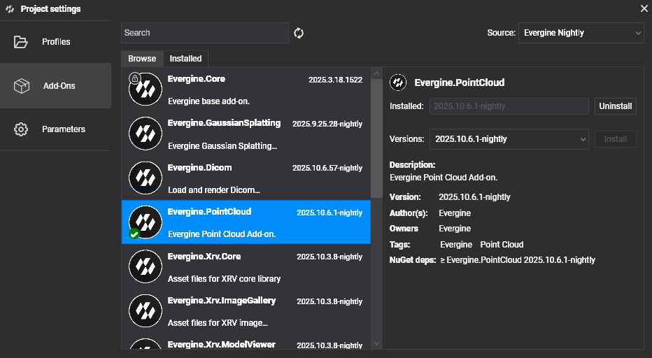

# Getting Started

---

Follow these steps to begin working with **Evergine.Cesium** in your project.

## Project Setup

### 1. Create a New Project

Use [Evergine Launcher](../../evergine_launcher/create_project.md) to start a new project. Select **Windows** or another supported desktop/mobile platform.

> [!NOTE]
> Evergine.Cesium does **not** support Web platforms (WebGL / WebGPU). Please choose a different platform profile.

### 2. Add the Evergine.Cesium Add-on

Open Evergine Studio and add the **Evergine.Cesium** add-on to your project. Refer to [this guide](../../addons/index.md) for instructions on adding add-ons.



> [!NOTE]
> Evergine.Cesium is distributed as a NuGet package. For nightly builds, add the Evergine nightly feed to your `nuget.config`:
> 
> ```xml
> <?xml version="1.0" encoding="utf-8"?>
> <configuration>
>   <packageSources>
>     <add key="nuget.org" value="https://api.nuget.org/v3/index.json" />
>     <add key="Evergine Nightly" value="https://pkgs.dev.azure.com/plainconcepts/Evergine.Nightly/_packaging/Evergine.NightlyBuilds/nuget/v3/index.json" />
>   </packageSources>
> </configuration>
> ```

### 3. Set Up the CesiumCoordinator

`CesiumCoordinator` is the central scene manager that drives terrain streaming, camera navigation, and optional geocoding. Register it inside your scene's `RegisterManagers()` override:

```csharp
using Evergine.Cesium;
using Evergine.Framework;

public class MyScene : Scene
{
    public override void RegisterManagers()
    {
        base.RegisterManagers();

        var cesium = new CesiumCoordinator
        {
            AccessToken = "<CESIUM_ION_TOKEN>",
            AzureMapsKey = "<OPTIONAL_AZURE_MAPS_KEY>",  // leave null if not needed
            EntityManager = this.Managers.EntityManager,
            OverlayProvider = TerrainOverlayProvider.BingAerial,
        };

        this.Managers.AddManager(cesium);

        // Optional: fly to a starting location on scene load
        // cesium.FlyTo(40.4168, -3.7038, 3.0);
    }
}
```

---

## Core Runtime API

Once registered, you can access `CesiumCoordinator` from anywhere in your scene via `this.Managers.FindManager<CesiumCoordinator>()`.

### Initialization & Status

| Member | Type | Description |
|---|---|---|
| `IsInitialized` | `bool` | `true` once the coordinator has successfully connected to Cesium ion. |
| `CurrentStatus` | `CesiumStatus` | Detailed loader state including connectivity and authentication results. |

### Camera & Navigation

| Member | Description |
|---|---|
| `FlyTo(latitude, longitude, seconds)` | Smoothly animates the camera to the given geodetic position over the specified duration. |
| `WorldCamera` | Returns the current geospatial camera state (latitude, longitude, altitude, heading, pitch). |

### Terrain

| Member | Description |
|---|---|
| `QueryTerrainMinHeight(latitude, longitude, callback)` | Asynchronously samples terrain height at the given coordinates and invokes the callback with the result. |

### Geocoding *(requires Azure Maps key)*

| Member | Description |
|---|---|
| `GeocodeAsync(query)` | Searches for a place by address or name and returns matching results. |
| `ReverseGeocodeAsync(latitude, longitude)` | Returns the address for the given coordinates. |
| `AutocompleteAsync(query, maxResults)` | Returns autocomplete suggestions for a partial address or place name. |

### Diagnostics

| Member | Description |
|---|---|
| `Diagnostics` | Exposes tile queue and streaming counters (tiles loaded, pending, cancelled…). |
| `UnmanagedDiagnostics` | Exposes native memory allocation and free counters for low-level profiling. |

---

## Placing Entities on Earth

Attach a `CesiumPlacerComponent` to any entity to position it using geodetic coordinates. The component automatically converts coordinates to world space each frame and aligns the entity's orientation to the local up vector.

| Property | Type | Description |
|---|---|---|
| `Latitude` | `double` | Latitude in decimal degrees (−90 to 90). |
| `Longitude` | `double` | Longitude in decimal degrees (−180 to 180). |
| `Height` | `double` | Height in metres. |
| `HeightIsRelativeToTerrain` | `bool` | When `true`, `Height` is measured above the terrain surface. When `false`, it is measured above the WGS84 ellipsoid. |
| `Rotation` | `Vector3` | Local orientation offset applied after aligning to the Earth's surface. |

```csharp
// Example: place a marker at the Eiffel Tower, 10 m above ground
var marker = new Entity("EiffelTower")
    .AddComponent(new Transform3D())
    .AddComponent(new CesiumPlacerComponent
    {
        Latitude  = 48.8584,
        Longitude =  2.2945,
        Height    = 10.0,
        HeightIsRelativeToTerrain = true,
    })
    .AddComponent(new SphereMesh())
    .AddComponent(new MeshRenderer());

this.Managers.EntityManager.Add(marker);
```

---

## FAQ

**Q: Can I change the imagery overlay at runtime?**

Yes. Set `CesiumCoordinator.OverlayProvider` to any `TerrainOverlayProvider` value at any time. Terrain tiles are automatically reset and reloaded with the new imagery.

**Q: Do I need to manage tile or texture memory manually?**

No. The add-on handles all tile lifecycle management — loading, caching, and eviction — automatically.

**Q: What happens if I don't provide an Azure Maps key?**

Geocoding methods (`GeocodeAsync`, `ReverseGeocodeAsync`, `AutocompleteAsync`) will not work. All other features — terrain, buildings, imagery, camera navigation, and entity placement — remain fully functional.

**Q: My scene loads but the terrain is blank. What should I check?**

1. Verify that your Cesium ion access token has the correct permissions for **Cesium World Terrain** and **3D Tiles**.
2. Check `CesiumCoordinator.CurrentStatus` for connectivity or authentication errors.
3. Ensure the scene has a **MainCamera** entity with a `Camera3D` component.
