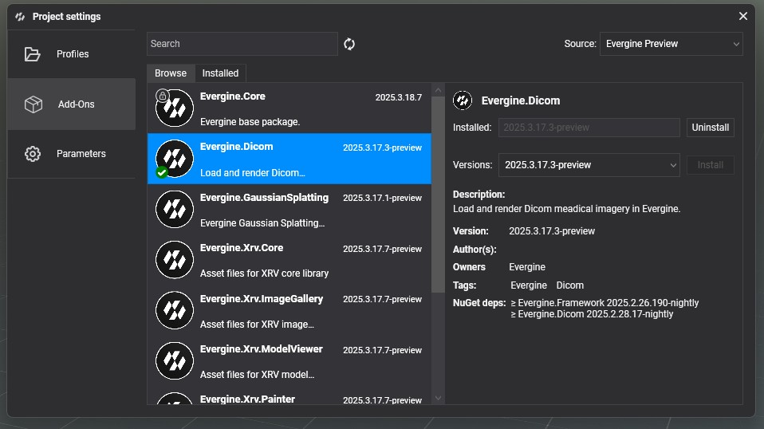
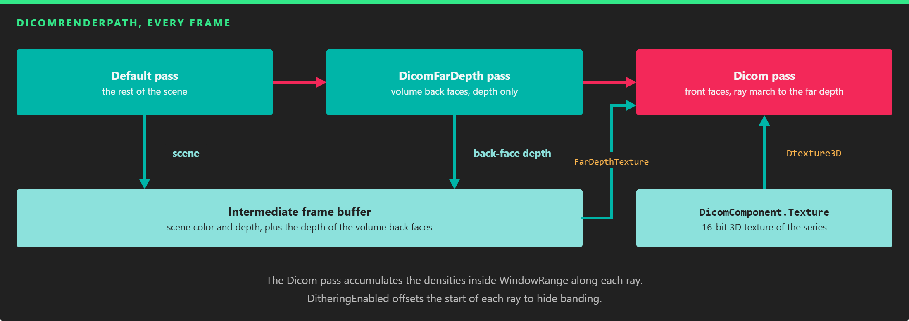
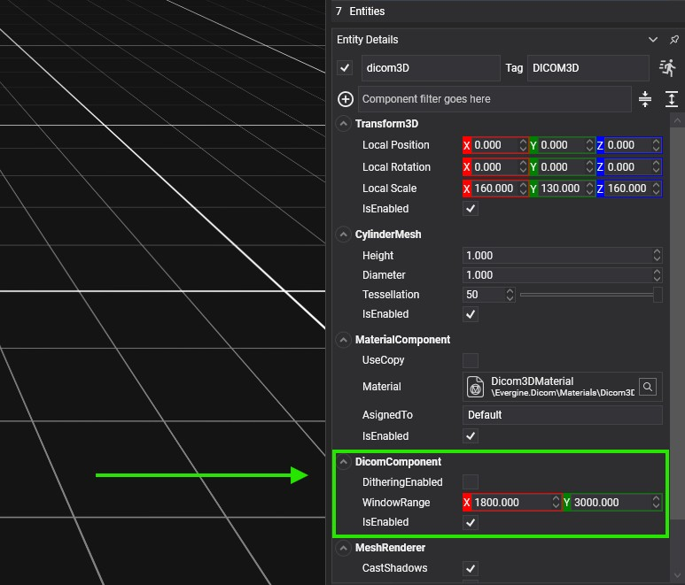
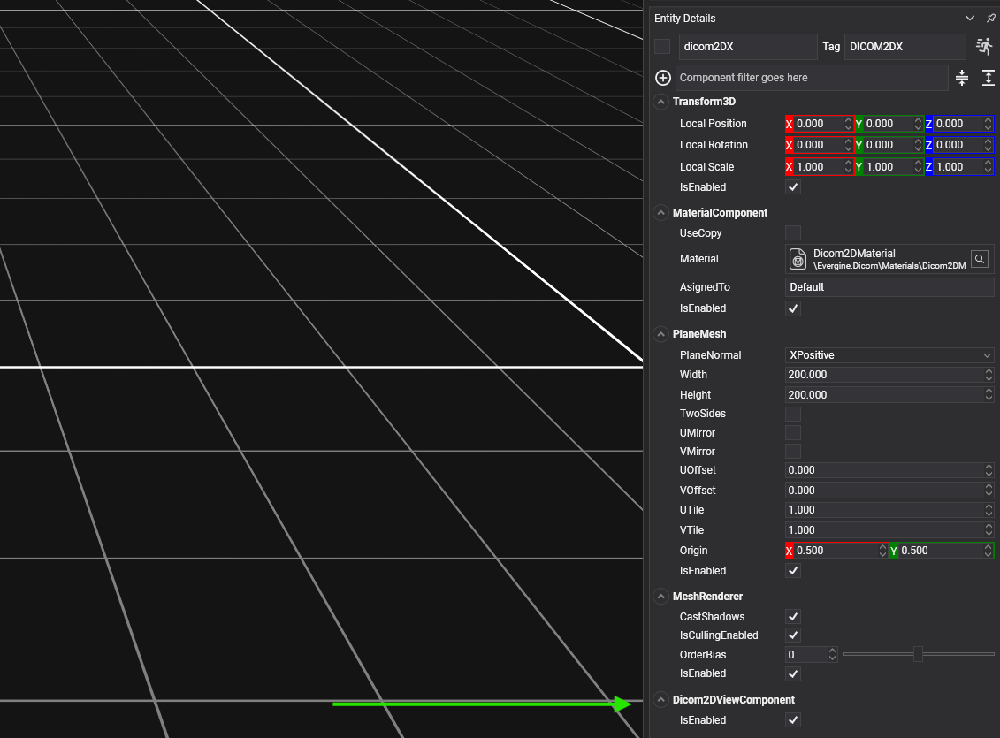

# Getting started with DICOM

---


This page shows how to load a DICOM series and render it in 2D and 3D. You create an entity with a `DicomComponent` that loads the images into a 3D texture, then add a `DicomRenderer` to draw the volume and one `DicomRenderer2D` per slice plane. The 3D view needs a custom render path, which the add-on provides.

The [DICOM demo](https://github.com/EvergineTeam/Dicom-Demo) shows all of this working, with controls to change the density window and move the slice planes.

## Project setup

### 1. Install the add-on

In Evergine Studio, open the [Add-ons Manager](../index.md#add-ons-manager) and install **Evergine.Dicom**.



### 2. Set the DICOM render path

Volume rendering needs extra passes, so the add-on provides `DicomRenderPath` (namespace `Evergine.Dicom`). Set it up in one of two ways:

- For one camera, assign it to the camera's `RenderPath`:

```csharp
using Evergine.Dicom;
using Evergine.Framework.Graphics;
using Evergine.Framework.Managers;

// In your scene's CreateScene.
var camera = this.Managers.EntityManager.FindFirstComponentOfType<Camera>(isExactType: false);
camera.RenderPath = new DicomRenderPath((RenderManager)this.Managers.RenderManager);
```

- For every camera, replace the default render path of the render pipeline with the helper extension methods:

```csharp
// Replaces the default render path with DicomRenderPath and returns it.
this.Managers.RenderManager.ReplaceDefaultRenderPathWithDicomRenderPath();

// Restores the default render path.
this.Managers.RenderManager.ReplaceDicomRenderPathWithDefaultRenderPath();
```

> [!NOTE]
> The 2D slices do not need the DICOM render path. If your application only shows slices, skip this step.

## How the volume is rendered

`DicomRenderPath` renders three passes. The **Default** pass draws the rest of the scene as usual. The **DicomFarDepth** pass draws the back faces of the volume mesh and stores their depth. The **Dicom** pass draws the front faces and, for each pixel, marches a ray through the 3D texture from the front face to the stored far depth, accumulating the densities that fall inside the window range.



*The far depth pass tells the ray marcher where each ray leaves the volume.*

## Load a DICOM series

`DicomComponent` loads the images and keeps them in a 3D texture that the renderers share. Call `LoadFromFile` with the path of a `.zip` file. The loader reads every file in the archive as a DICOM image, whatever its folder or extension, so the files do not need the `.dcm` extension.

> [!IMPORTANT]
> Every file inside the ZIP must be a valid DICOM file. Only 16-bit single-channel images are supported; `LoadFromFile` returns `false` for other formats.

`LoadFromFile` is asynchronous and returns `true` when the texture is ready:

```csharp
using System.Diagnostics;
using Evergine.Common.IO;
using Evergine.Dicom;
using Evergine.Framework;

public class DicomScene : Scene
{
    protected override async void CreateScene()
    {
        this.Managers.RenderManager.ReplaceDefaultRenderPathWithDicomRenderPath();

        var dicomPath = new AssetsDirectory().RootPath + "/Dicoms/sample.zip";
        var entities = await this.CreateDicomEntities(dicomPath, create2D: true, create3D: true);
        if (entities.Length == 0)
        {
            Trace.TraceError("The DICOM file could not be loaded.");
        }
    }
}
```

`CreateDicomEntities` is a helper, also available as `DicomHelpers.CreateDicomEntities`, that loads the file and creates all the entities described below in one call. It returns three disabled slice entities (X, Y, and Z) followed by the volume entity, or an empty array if the file cannot be loaded. The volume mesh is a cylinder by default; pass `cylinderMeshShape: false` to use a cube.

### DicomComponent

| Property | Default | Description |
| --- | --- | --- |
| `WindowRange` | `(1800, 3000)` | Density window, minimum and maximum. Only densities inside it are visible. Loading a file resets it to `LimitWindowRange`. |
| `LimitWindowRange` | `(-1000, 3500)` | Read-only. Density range of the loaded series. |
| `PixelsX`, `PixelsY`, `PixelsZ` | `0` | Read-only. Size of the series in pixels: width, height, and number of slices. |
| `PixelSpacing` | `(0, 0, 0)` | Read-only. Size of one pixel, in millimeters. |
| `SizeMM` | `(0, 0, 0)` | Read-only. Size of the whole volume, in millimeters. |
| `Texture` | `null` | Read-only. The 3D texture with the images. |

| Event | Description |
| --- | --- |
| `OnDicomLoadedEvent` | Raised when a series is loaded. |
| `OnWindowChangedEvent` | Raised when `WindowRange` changes, with the window normalized to the limit range. |

Change `WindowRange` at runtime to let the user pick what to see, for example bone or soft tissue:

```csharp
// dicomComponent is the DicomComponent of your volume entity; Vector2 is in Evergine.Mathematics.
// Show only the densest part of the loaded range.
var limits = dicomComponent.LimitWindowRange;
dicomComponent.WindowRange = new Vector2(limits.X + (limits.Y - limits.X) * 0.6f, limits.Y);
```

## 3D visualization

To render the volume, [set the DICOM render path](#2-set-the-dicom-render-path) and create an entity with these components:

- `Transform3D`: places the volume. `DicomRenderer` sets its scale to `SizeMM` when a series loads, so scale a parent entity to change the size.
- `DicomComponent`.
- A mesh component, such as `CubeMesh` or `CylinderMesh`, that contains the volume. Its vertices must fit the box from (-0.5, -0.5, -0.5) to (0.5, 0.5, 0.5), which the renderer maps to the whole series.
- `DicomRenderer`, which replaces `MeshRenderer`.
- `MaterialComponent` with the `Dicom3DMaterial` material (`AssetIds.Materials.Dicom3DMaterial`).



```csharp
using Evergine.Components.Graphics3D;
using Evergine.Dicom;
using Evergine.Framework;
using Evergine.Framework.Graphics;

var dicomComponent = new DicomComponent();
var volume = new Entity("DicomVolume")
    .AddComponent(new Transform3D())
    .AddComponent(dicomComponent)
    .AddComponent(new CubeMesh() { Size = 1 })
    .AddComponent(new DicomRenderer())
    .AddComponent(new MaterialComponent()
    {
        Material = this.Managers.AssetSceneManager.Load<Material>(AssetIds.Materials.Dicom3DMaterial),
    });

this.Managers.EntityManager.Add(volume);
await dicomComponent.LoadFromFile(dicomPath);
```

| `DicomRenderer` property | Default | Description |
| --- | --- | --- |
| `DitheringEnabled` | `true` | Offsets the start of each ray randomly to remove the [banding](https://en.wikipedia.org/wiki/Colour_banding) of the volume, at the cost of a little noise. |

### Choose the mesh

A cube of size 1 centered at the origin is the simplest volume. If you know how the images were captured, a mesh closer to the shape of the scanned data renders faster, because fewer rays cross empty space. Most [CT scanners](https://en.wikipedia.org/wiki/CT_scan) are cylindrical, so their data fits in a cylinder, which is why `CreateDicomEntities` uses a `CylinderMesh` by default.

## 2D visualization

Each slice is a separate entity with an axis-aligned plane. Create one entity per slice with these components:

- `Transform3D`: the position of the plane. Move it to move the slice through the volume.
- `PlaneMesh` with an axis-aligned `PlaneNormal` and a large `Width` and `Height`, for example 1000, so the plane crosses the whole volume. Outside the volume, the plane is drawn black.
- `DicomRenderer2D`, with its `Dicom` property set to the `DicomComponent` of the volume entity.
- `MaterialComponent` with the `Dicom2DMaterial` material (`AssetIds.Materials.Dicom2DMaterial`).



```csharp
var slice = new Entity("DicomSliceZ")
    .AddComponent(new Transform3D())
    .AddComponent(new PlaneMesh() { PlaneNormal = PlaneMesh.NormalAxis.ZPositive, Width = 1000, Height = 1000 })
    .AddComponent(new DicomRenderer2D() { Dicom = dicomComponent })
    .AddComponent(new MaterialComponent()
    {
        Material = this.Managers.AssetSceneManager.Load<Material>(AssetIds.Materials.Dicom2DMaterial),
    });

this.Managers.EntityManager.Add(slice);
```

If your application only shows slices, the entity with the `DicomComponent` only needs a `Transform3D` and the `DicomComponent`, and you do not need the DICOM render path.
