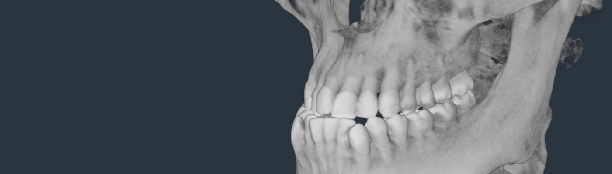
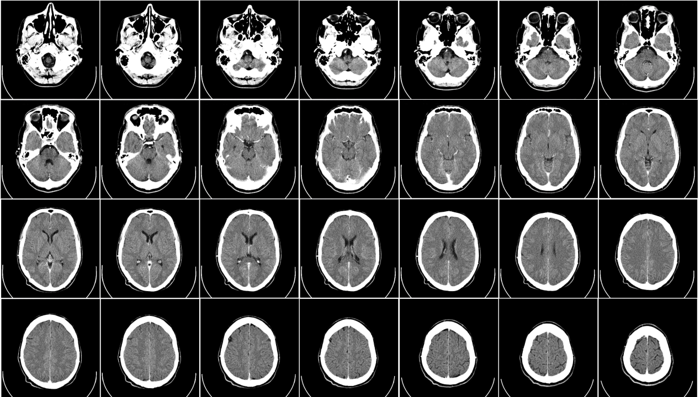

# DICOM

---

Evergine DICOM Add-on provides a way to render DICOM images within the Evergine engine. It offers tools to load, process, and visualize medical imaging data in a 3D environment, making it easier to integrate DICOM visualization into Evergine-based applications.

Evergine DICOM add-on supports rendering single-channel images both in 2D and 3D.

* **2D**: Is it possible to render 2D slices of the DICOM file in the X, Y or Z axis.
* **3D**: Render a 3D volume, allowing to set density thresholds.

## What is DICOM?

**DICOM** — *Digital Imaging and Communications in Medicine* — is the international standard for medical images and related information. It defines the formats for medical images that can be exchanged with the data and quality necessary for clinical use.

DICOM is implemented in almost every radiology, cardiology imaging, and radiotherapy device (X-ray, CT, MRI, ultrasound, etc.), and increasingly in devices in other medical domains such as ophthalmology and dentistry. With hundreds of thousands of medical imaging devices in use, DICOM is one of the most widely deployed healthcare messaging Standards in the world. There are literally billions of DICOM images currently in use for clinical care.

- [Getting started](getting_started.md)