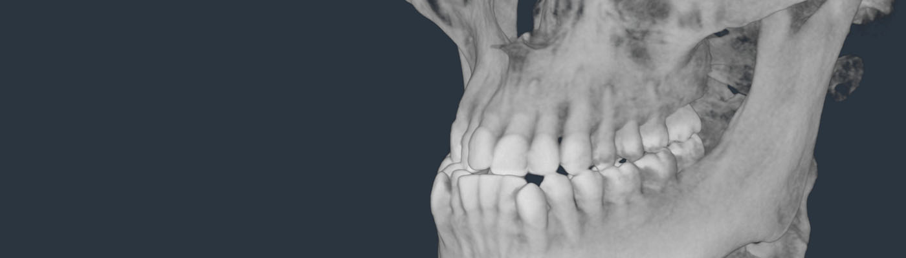
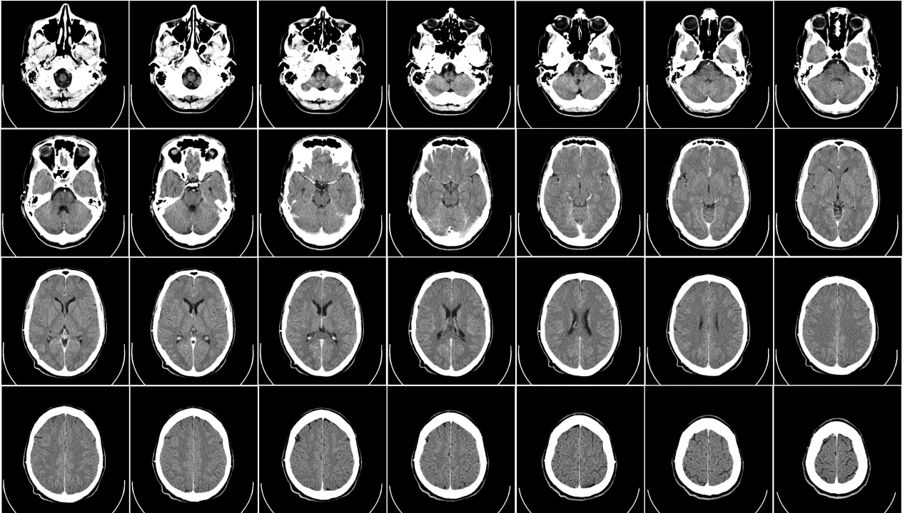

# DICOM

---

The **Evergine DICOM** add-on loads DICOM medical images and renders them in Evergine, as 2D slices or as a 3D volume. Use it to build medical viewers where users inspect CT or MRI scans in 3D, cut them with planes, and choose the density range they want to see.

The add-on renders single-channel 16-bit images:

* **2D**: slices of the series along the X, Y, or Z axis.
* **3D**: a volume rendered by ray marching, with an adjustable density window.

It runs on Windows (x64) and on the Web platform.

## What is DICOM?

**DICOM** (Digital Imaging and Communications in Medicine) is the international standard for medical images and the information related to them. It defines how images are stored and exchanged with the quality that clinical use requires.

Almost every radiology, cardiology, and radiotherapy device uses DICOM, including X-ray, CT, MRI, and ultrasound scanners, and it is increasingly common in other fields such as ophthalmology and dentistry. A CT or MRI study is usually a series of DICOM files, one per slice, that together describe a 3D volume.

## In this section

- [Getting started](getting_started.md)
