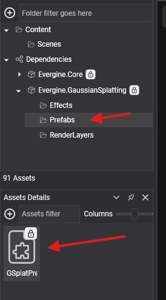
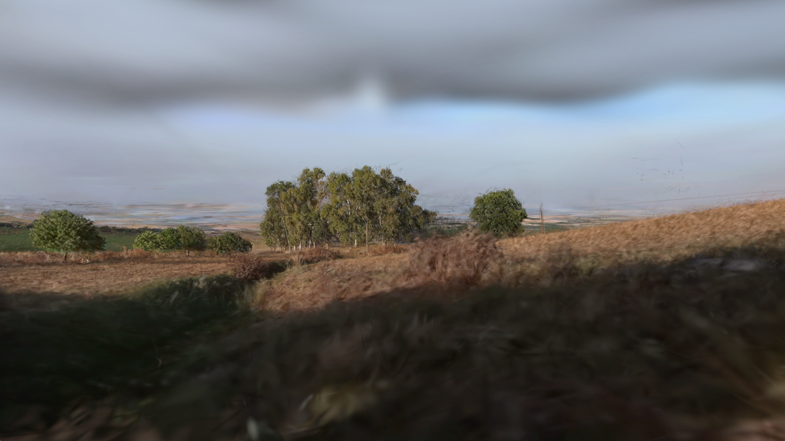
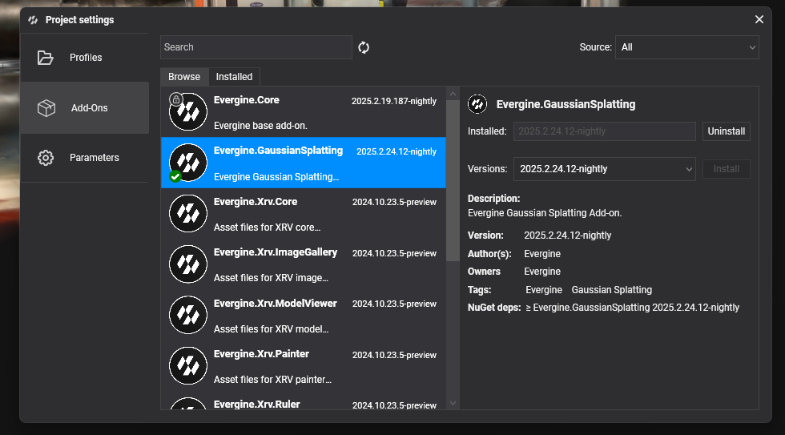
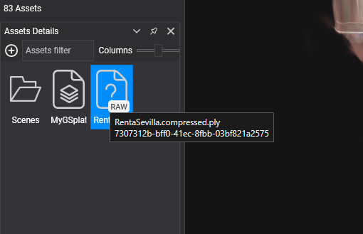
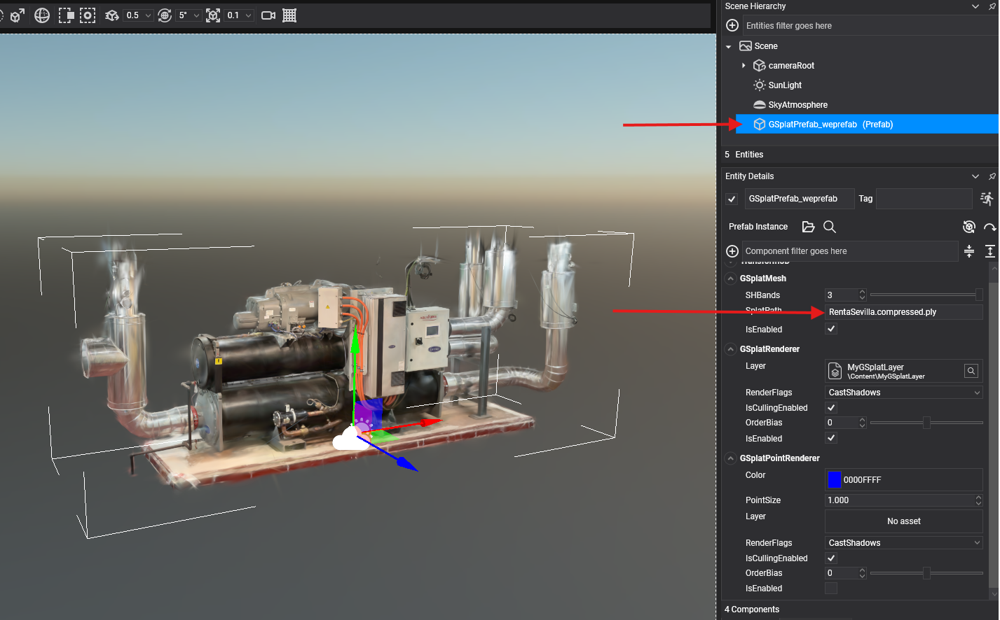
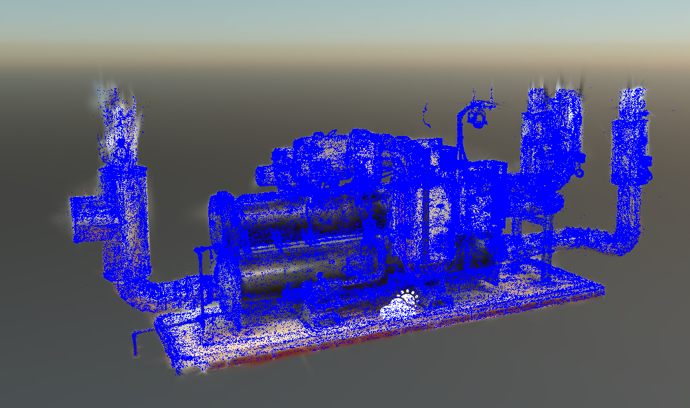

# Getting started with Gaussian Splatting

---



This page adds the Gaussian Splatting add-on to a project, loads a splat file into a scene, and describes the components that load and draw it. You can set everything up in Evergine Studio with the prefab that the add-on provides, or create the entity from code.



## Project setup

### 1. Create a project

Create a project with [Evergine Launcher](../../evergine_launcher/create_project.md). Along with Windows, add the profiles for the other devices you target.

### 2. Install the add-on

In Evergine Studio, open the [Add-ons Manager](../index.md#add-ons-manager) and install **Evergine.GaussianSplatting**.



> [!IMPORTANT]
> Web profiles (WebGL and WebGPU) need a few more steps, described in [Web setup](web_setup.md).

> [!NOTE]
> The add-on references NuGet packages. To use nightly builds, add the Evergine nightly feed to your `nuget.config`:
>
> ```xml
> <?xml version="1.0" encoding="utf-8"?>
> <configuration>
>   <packageSources>
>     <add key="nuget.org" value="https://api.nuget.org/v3/index.json" />
>     <add key="Evergine Nightly" value="https://pkgs.dev.azure.com/plainconcepts/Evergine.Nightly/_packaging/Evergine.NightlyBuilds/nuget/v3/index.json" />
>   </packageSources>
> </configuration>
> ```

### 3. Add a splat file to the project

Add a file in one of the [supported formats](index.md#supported-formats) to your project content, for example by dragging it into the **Assets Details** panel.



### 4. Add the Gaussian Splatting prefab

Drag the `GSplatPrefab` prefab from **Dependencies > Evergine.GaussianSplatting > Prefabs** into your scene. In its `GSplatMesh` component, set `SplatPath` to the path of your splat file, relative to the content folder.



The prefab contains an entity with these components:

- **GSplatMesh**: loads the splat file.
- **GSplatRenderer**: sorts and draws the splats.
- **GSplatPointRenderer**: draws a point at the center of each splat. It is disabled by default.
- **GSplatCursorFollower**: finds the 3D position of the splats under the mouse cursor. It is disabled by default.

## Create the entity from code

```csharp
using Evergine.Framework;
using Evergine.Framework.Graphics;
using Evergine.GaussianSplatting;

public class MyScene : Scene
{
    protected override void CreateScene()
    {
        var gaussianSplatting = new Entity("GaussianSplatting")
            .AddComponent(new Transform3D())
            .AddComponent(new GSplatMesh()
            {
                // Relative to the content folder, or an absolute path on disk.
                SplatPath = "Splats/bicycle.ply",
            })
            .AddComponent(new GSplatRenderer())
            // Optional: shows the splat centers as points.
            .AddComponent(new GSplatPointRenderer() { IsEnabled = false });

        this.Managers.EntityManager.Add(gaussianSplatting);
    }
}
```

## GSplatMesh

`GSplatMesh` loads the splat scene and exposes it as a `GSplatScene`. When you change `SplatPath` at runtime, it releases the current scene and loads the new file. `SplatPath` can be a path inside your project content, an absolute file path, or a folder for LCC scenes.

| Property | Default | Description |
| --- | --- | --- |
| `SplatPath` | `null` | Path of the splat file or LCC folder to load. |
| `SHBands` | `3` | Number of spherical harmonics bands used to render, from 0 to 3. Fewer bands render faster but lose view-dependent color. The file must contain the bands you ask for. |
| `MinContribution` | `0` | Minimum screen contribution, in alpha-pixels, that a splat must reach to be drawn. `0` disables the test. Higher values skip small, faint splats and can make rendering much faster on mobile devices, but values around 0.25 visibly remove fine detail such as fur or hair. Clamped between 0 and 1. |
| `SortIntervalMs` | `0` | Minimum time, in milliseconds, between two sorts of the splats. `0` sorts every frame. A higher value lowers CPU work and power use, at the cost of ordering errors while the camera moves; the order is correct again shortly after the camera stops. |
| `UseSelectionTexture` | `false` | Creates the per-splat selection texture when the scene loads. Needed for [selection](#selection-and-segmentation). |
| `UseSegmentationTexture` | `false` | Creates the per-splat segmentation texture when the scene loads. Needed for [segmentation](#selection-and-segmentation). |
| `GSplatScene` | | Read-only. The loaded scene, or `null`. |
| `IsGSplatSceneLoaded` | | Read-only. `true` when a scene with at least one splat is loaded. |

> [!NOTE]
> `SortIntervalMs` applies to the sorters that the renderer dispatches from its draw loop: the GPU sorter, the managed sorter, and the web worker sorter. The native sorter runs in its own thread and ignores it.

| Event | Arguments | Description |
| --- | --- | --- |
| `OnSplatSceneLoading` | `EventArgs` | Raised before a scene starts loading, and before the previous one is released. |
| `OnSplatSceneLoaded` | `GSplatScene` | Raised when a scene is loaded and ready to render. |

If a file cannot be found or read, `GSplatMesh` logs the error, clears `SplatPath`, and throws the exception.

The following component waits for the scene to load and reduces the quality on mobile devices:

```csharp
using System;
using Evergine.Framework;
using Evergine.GaussianSplatting;

public class SplatQuality : Component
{
    [BindComponent]
    private GSplatMesh gSplatMesh = null;

    protected override void OnActivated()
    {
        base.OnActivated();
        this.gSplatMesh.OnSplatSceneLoaded += this.OnSplatSceneLoaded;
    }

    protected override void OnDeactivated()
    {
        base.OnDeactivated();
        this.gSplatMesh.OnSplatSceneLoaded -= this.OnSplatSceneLoaded;
    }

    private void OnSplatSceneLoaded(object sender, GSplatScene scene)
    {
        if (OperatingSystem.IsAndroid() || OperatingSystem.IsIOS())
        {
            // Fewer spherical harmonics bands and skipping faint splats keep the frame rate up.
            this.gSplatMesh.SHBands = 1;
            this.gSplatMesh.MinContribution = 0.05f;
            this.gSplatMesh.SortIntervalMs = 50;
        }
    }
}
```

## GSplatRenderer

`GSplatRenderer` is the `Drawable3D` that draws the scene loaded by `GSplatMesh`. When it is attached, it registers the Gaussian Splatting render feature, and it picks a sorter, checking these rules in order:

| Condition | Sorter |
| --- | --- |
| The backend is WebGPU or DirectX 11 and supports compute shaders. | `GSplatGpuSorter`, which sorts on the GPU. |
| The application runs in Evergine Studio, on Android, or on iOS. | `GSplatSorter`, a managed sorter. |
| Any other case, such as DirectX 12 or Vulkan on Windows. | `GSplatNativeSorter`, a native sorter that runs in its own thread. |

If the application container has an `IGSplatSorter` registered, the renderer uses it instead. The [Web setup](web_setup.md) registers `WorkerGSplatSorter` this way.

| Property | Default | Description |
| --- | --- | --- |
| `Layer` | `null` | Render layer used to draw the splats. `null` uses the add-on's `GSplatLayer`. |

## GSplatPointRenderer

`GSplatPointRenderer` draws a point at the center of each splat. It helps you inspect the density of a scene or its position before the splats are sorted.



| Property | Default | Description |
| --- | --- | --- |
| `Color` | `Color.Blue` | Color of the points. |
| `PointSize` | `1` | Size of the points, in pixels. |
| `Layer` | `null` | Render layer used to draw the points. `null` uses the add-on's `GSplatPointLayer`. |

## GSplatCursorFollower

`GSplatCursorFollower` (namespace `Evergine.GaussianSplatting.Components`) finds the point of the splat scene under the mouse cursor. While it is enabled, the renderer writes the depth of the splats at the cursor position, and `CursorPosition` returns that point in world coordinates, or `null` when no scene is loaded. Use it to place markers or to measure on top of a splat scene.

```csharp
using System;
using Evergine.Common.Graphics;
using Evergine.Common.Input;
using Evergine.Common.Input.Mouse;
using Evergine.Framework;
using Evergine.Framework.Managers;
using Evergine.GaussianSplatting.Components;

public class SplatPicker : Behavior
{
    [BindComponent(source: BindComponentSource.Scene)]
    private GSplatCursorFollower cursorFollower = null;

    protected override void Update(TimeSpan gameTime)
    {
        var mouse = this.Managers.RenderManager.ActiveCamera3D.Display.MouseDispatcher;
        if (mouse.ReadButtonState(MouseButtons.Left) == ButtonState.Pressing
            && this.cursorFollower.CursorPosition is { } position)
        {
            // Draw a red point where the user clicked on the splats.
            ((RenderManager)this.Managers.RenderManager).LineBatch3D.DrawPoint(position, 0.05f, Color.Red);
        }
    }
}
```

Enable the `GSplatCursorFollower` component of the prefab for this to work. Reading the cursor depth has a cost, so enable the component only while you need it.

## Selection and segmentation

`GSplatScene` includes per-splat textures that let you highlight, hide, or color groups of splats. They are created only when you enable `UseSelectionTexture` or `UseSegmentationTexture` in `GSplatMesh` before the scene loads.

- **Selection.** `GSplatScene.SelectionTexture` stores one byte per splat (`R8_UInt`). `0` means not selected, `1` is the preview selection, and higher IDs are selections: splats with an ID up to `CurrentSelectionID` are tinted with `SelectionColor`, and the preview with `PreviewSelectionColor`. Splats whose ID has the highest bit set (`0x80`) are treated as deleted: they are not drawn and they are skipped by `ExportAsSplat` and `ExportAsCompressedPLY`. Set `RenderSelection` to `true` to show the selection.
- **Segmentation.** `GSplatMesh.SetSegmentationData(labelData, colorPalette)` assigns a label to each splat and a color to each label, with up to 256 labels; label 0 is reserved and keeps the original color. The alpha of each palette color controls how much it replaces the splat color. `RenderSegmentation` shows or hides the colors, and `ClearSegmentationData` removes them.

```csharp
using Evergine.GaussianSplatting;
using Evergine.Mathematics;

public static class SegmentationSample
{
    // Colors the first half of the splats red and the rest green.
    public static void ColorHalves(GSplatMesh gSplatMesh)
    {
        int count = gSplatMesh.GSplatScene.NumSplats;
        var labels = new uint[count];
        for (int i = 0; i < count; i++)
        {
            labels[i] = i < count / 2 ? 1u : 2u;
        }

        var palette = new[]
        {
            Vector4.Zero,                  // Label 0 is reserved.
            new Vector4(1, 0, 0, 0.8f),    // Label 1: red, 80% over the splat color.
            new Vector4(0, 1, 0, 0.8f),    // Label 2: green.
        };

        // Requires UseSegmentationTexture = true before the scene loads.
        gSplatMesh.SetSegmentationData(labels, palette);
    }
}
```
