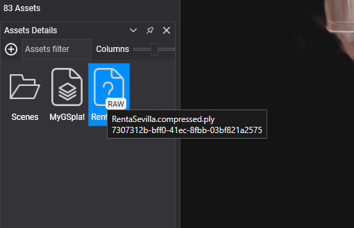

# Getting Started
---
Follow these steps to begin working with 3D Gaussian Splatting in your Evergine applications:

## Project Setup

### 1. Create a New Project

Use [Evergine Launcher](../../evergine_launcher/create_project.md) to start a new project. Along with Windows, select an additional template for your target device.

### 2. Add the Evergine.GaussianSplatting Add-on

Open Evergine Studio and add the Evergine.GaussianSplatting add-on to your project. Refer to [this guide](../../addons/index.md) for instructions on adding add-ons.


> [!NOTE]
> If you are using a Web profile, you need to perform the additional steps described in this document: [Setup Gaussian Splatting on the Web Platform](web_setup.md)

> [!NOTE]
> Gaussian Splatting add-ons are available as NuGet packages. For nightly builds, update `nuget.config` to include the Evergine nightly feed:
>```xml
><?xml version="1.0" encoding="utf-8"?>
><configuration>
>  <packageSources>
>    <add key="nuget.org" value="https://api.nuget.org/v3/index.json" />
>    <add key="Evergine Nightly" value="https://pkgs.dev.azure.com/plainconcepts/Evergine.Nightly/_packaging/Evergine.NightlyBuilds/nuget/v3/index.json" />
>  </packageSources>
></configuration>
>```

### 3. Add Your Splat File to the Project

In Evergine Studio, add a supported 3D Gaussian Splatting file (`.splat` or compressed `.ply` file) to your project:




### 4. Instantiate Gaussian Splatting prefab

Instantiate the `GSplatPrefab` prefab in your scene, located in the ``Dependencies > Evergine.GaussianSplatting > Prefabs`` folder:


In the ``GSplatMesh`` component, set the `SplatPath` property to the path of the 3D Gaussian Splat file:


This prefab creates an Entity and adds the following components:
- **GSplatMesh:** Responsible for loading the Gaussian Splatting file.
- **GSplatRenderer:** A drawable that renders the Gaussian Splatting.
- **GSplatPointRenderer:** A drawable (disabled by default) that renders a point cloud using the splat centers.

## Component Properties

### GSplatMesh Properties

The `GSplatMesh` component has the following properties:

| Property           | Description |
|--------------------|-------------|
| **SplatPath** | The path to the Gaussian Splatting file. You can change this property at runtime to dynamically update the Gaussian Splatting scene. |
| **SHBands** | The number of Spherical Harmonics bands used to render the Gaussian Splatting scene. |
| **IsSplatSceneLoaded** | Indicates whether a Gaussian Splatting scene is loaded. |
| **Layer** | The layer used to render the Gaussian Splatting. |

And the following event:

| Event           | Description |
|--------------------|-------------|
| **OnSplatSceneLoaded** | Triggered when a Gaussian Splatting scene is successfully loaded. |

### GSplatRenderer Properties

The ``GSplatRenderer`` is a Drawable3D component that renders the Gaussian Splatting loaded in the ``GSplatMesh`` component. It has the following property:

| Property           | Description |
|--------------------|-------------|
| **Layer** | The layer used to render the Gaussian Splatting. |

### GSplatPointRenderer

The `GSplatPointRenderer` component has the following properties:

| Property           | Description |
|--------------------|-------------|
| **Color** | The color of the points. |
| **PointSize** | The size of the points (in pixels). |
| **Layer** | The layer used to render the Gaussian Splatting point cloud. |

This component renders a point at each splat center:


## Create Gaussian Splatting from Code

The following code demonstrates how to load a Gaussian Splatting file into your Evergine scene:


```cs
var gaussianSplattingEntity = new Entity()
    .AddComponent(new Transform3D())
    .AddComponent(new GSplatMesh()
    {
        SplatPath = "MySplatPlyFile.ply"
    })
    .AddComponent(new GSplatRenderer())
    .AddComponent(new GSplatPointRenderer(){ IsEnabled = false}); // Add this component if you want to render the splats point cloud...
    

this.Managers.EntityManager.Add(gaussianSplattingEntity);
```