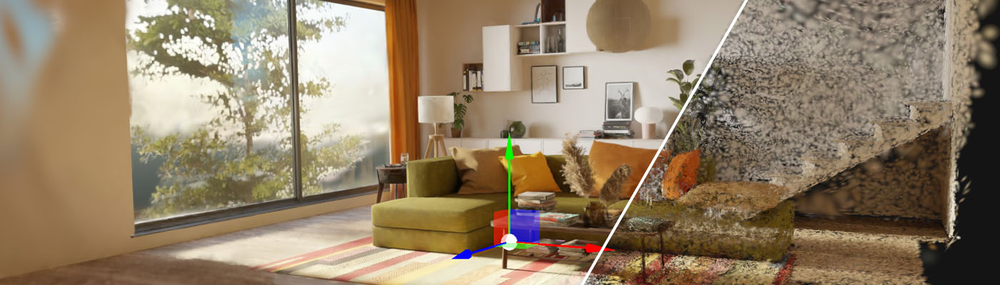
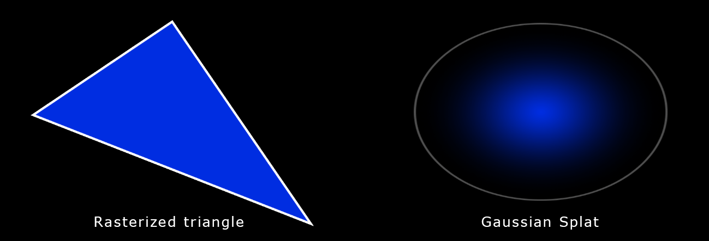
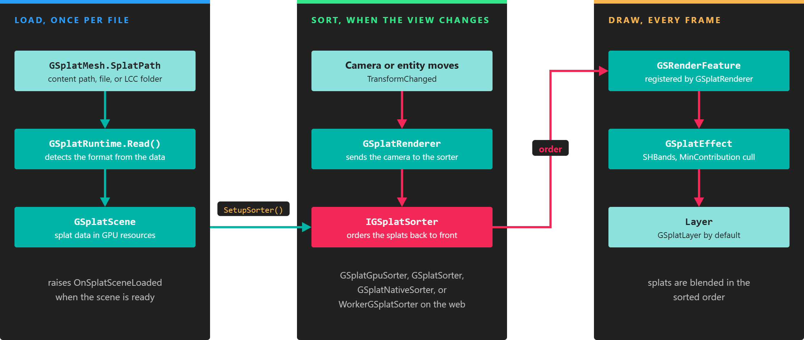

# 3D Gaussian Splatting

---

The **Evergine Gaussian Splatting** add-on loads and renders 3D Gaussian Splatting scenes in Evergine applications. Gaussian splats reproduce captured places and objects with photographic quality, and the add-on draws them in real time next to your regular 3D content, on desktop, mobile, and the web.

## What is 3D Gaussian Splatting?

Gaussian Splatting is a rendering technique that represents a scene as millions of small, semi-transparent 3D Gaussians instead of triangles. The technique has existed since the 1990s, but it became popular after the 2023 SIGGRAPH paper that applied it to real-time rendering of scenes reconstructed from photographs.

A training process computes the parameters of every Gaussian from a set of photos taken from different viewpoints. Rendering then works like triangle rasterization: each Gaussian is projected on the screen and blended with the others, sorted from back to front. Each Gaussian is described by:

* **Position**: where it is (XYZ).
* **Covariance**: how it is stretched and rotated, stored as a scale and a rotation.
* **Color**: its base color, plus optional spherical harmonics that change the color with the viewing direction.
* **Opacity**: its transparency (alpha).

This scene contains 7 million Gaussian splats:

## Supported formats

The add-on detects the format from the content of the file, not from its extension.

| Format | Extension | Description |
| --- | --- | --- |
| PLY | `.ply` | The standard output of 3D Gaussian Splatting training: one splat per vertex with position, scale, rotation, opacity, and color coefficients. ASCII and binary little-endian files are supported. |
| Compressed PLY | `.ply` | A compact variant of PLY. Splats are grouped in chunks of 256; each chunk stores the minimum and maximum position and scale, and each splat stores quantized position, scale, rotation, and color relative to them. |
| Splat | `.splat` | A simple packed format with position, scale, color, and rotation for each splat. |
| SPZ | `.spz` | A compressed format. Version 4 (NGSP) and legacy gzip SPZ files are supported. |
| KSplat | `.ksplat` | A compressed format that groups splats in spatial buckets and quantizes their attributes. |
| SOG | `.sog` | A ZIP archive with a `meta.json` file and the splat attributes stored as WebP images. |
| LCC | folder | A folder that contains a `meta.lcc` or `meta.lcc2` file. Point the add-on to the folder or to the meta file. |

> [!NOTE]
> LCC scenes are loaded from the file system only, because they are folders. The other formats can also be loaded from your project content.

## Rendering pipeline

The add-on renders splats in three stages. `GSplatMesh` reads the file into a `GSplatScene`, which uploads the splat data to the GPU. Every time the camera or the splat entity moves, `GSplatRenderer` asks a sorter to order the splats by depth. The render feature then draws the splats in that order, so their transparency blends correctly.

*Loading happens once per file; sorting and drawing happen whenever the view changes.*

## In this section

* [Getting started](getting_started.md)
* [Web setup](web_setup.md)
