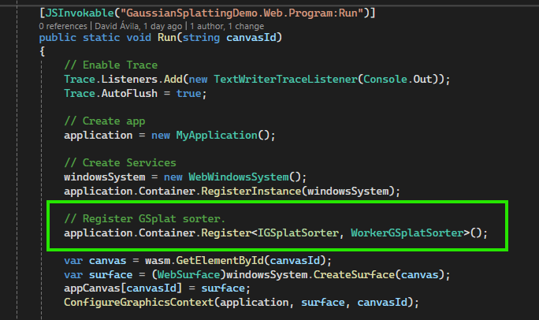
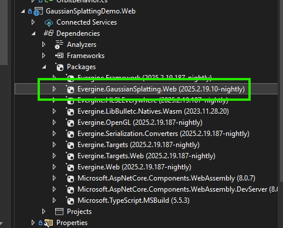
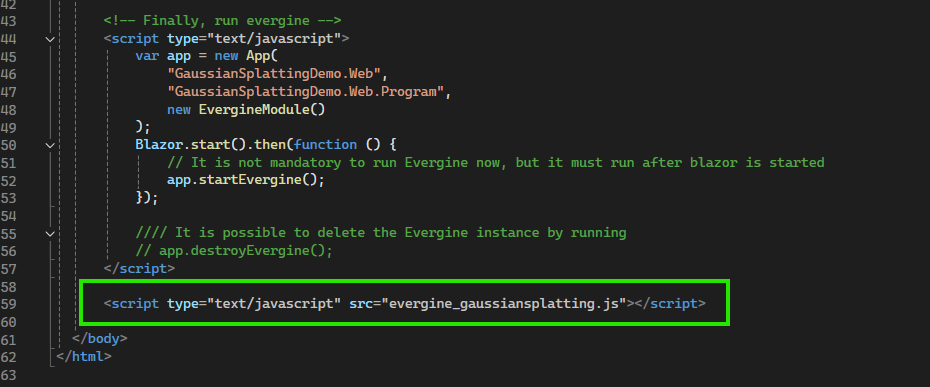
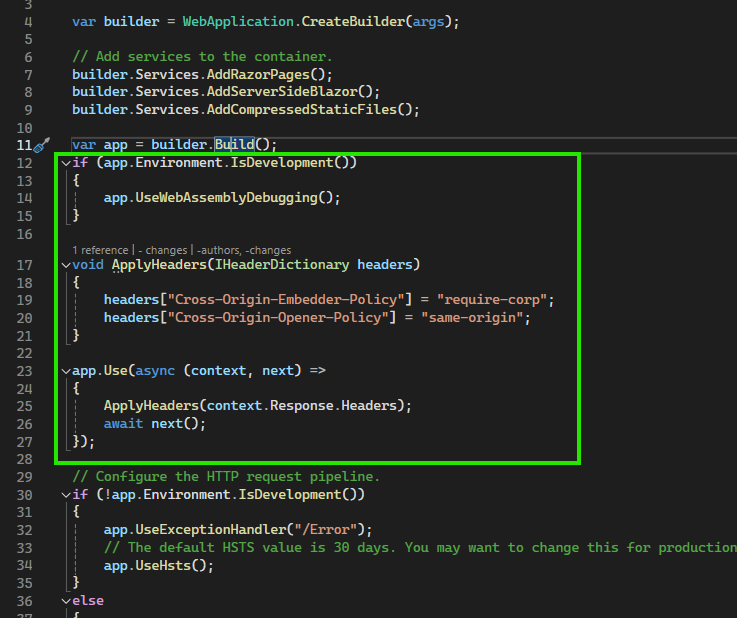

# Gaussian Splatting on the web

---



On the [Web](../../platforms/web/index.md) platform, the add-on sorts the splats in a Web Worker, a background thread of the browser, so sorting millions of splats does not block rendering. This needs a NuGet package in your web project, one line of registration, a script in `index.html`, and two HTTP headers that allow the browser to share memory with the worker. The steps are the same for the **Web** (WebGL) and **WebGPU** profiles, and they match the `SplatRender` sample of the add-on repository.

Before you start, complete the [Getting started](getting_started.md) steps and make sure your application has a Web or WebGPU profile.

## 1. Add the Evergine.GaussianSplatting.Web package

Add the `Evergine.GaussianSplatting.Web` NuGet package to your web project, usually named **[ApplicationName].Web** or **[ApplicationName].WebGPU**.



> [!IMPORTANT]
> Use the same version as the Evergine.GaussianSplatting add-on installed in your project.

When the project builds, the package copies its scripts to the `wwwroot` folder of your project: `evergine_gaussiansplatting.js`, `evergine_sortworker.js`, `gsplat_native_bundle.js`, `gsplat_native_bundle.wasm`, and `gsplat_cache.js`. It also generates `gsplat_cache_manifest.js`, which holds a hash of each file.

## 2. Register the web sorter

In the `Program.cs` file of the same project, register `WorkerGSplatSorter` as the `IGSplatSorter` of the application, in the `Run` method, right after the application is created:

```csharp
using Evergine.GaussianSplatting.Sorter;
using Evergine.GaussianSplatting.Web;

// Create app
application = new MyApplication();

// Sort the splats in a Web Worker instead of the default sorter.
application.Container.Register<IGSplatSorter, WorkerGSplatSorter>();
```

`GSplatRenderer` uses the sorter registered in the container before it chooses one of its own.

## 3. Load the script in index.html

Add the script at the end of the `body` of `wwwroot/index.html`, after the scripts that start Evergine:

```html
<script type="text/javascript" src="evergine_gaussiansplatting.js"></script>
```



> [!TIP]
> Browsers cache these scripts aggressively. The sample loads them through `gsplat_cache.js` and the generated manifest, which add the file hash to each URL, so users get the new files after you update the package:
>
> ```html
> <!-- In the head, before evergine.js -->
> <script type="text/javascript" src="gsplat_cache_manifest.js"></script>
> <script type="text/javascript" src="gsplat_cache.js"></script>
>
> <!-- At the end of the body, instead of the plain script tag -->
> <script type="text/javascript">
>     window.gSplatCache.loadScript("gaussiansplatting", "evergine_gaussiansplatting.js");
> </script>
> ```

## 4. Send the cross-origin isolation headers

The worker shares memory with the application through `SharedArrayBuffer`, which browsers only allow on cross-origin isolated pages. Make your server send these two headers with every response. In the `Program.cs` of your **[ApplicationName].Web.Server** or **[ApplicationName].WebGPU.Server** project, add this code right after `var app = builder.Build();`:

```csharp
if (app.Environment.IsDevelopment())
{
    app.UseWebAssemblyDebugging();
}

void ApplyHeaders(IHeaderDictionary headers)
{
    headers["Cross-Origin-Embedder-Policy"] = "require-corp";
    headers["Cross-Origin-Opener-Policy"] = "same-origin";
}

app.Use(async (context, next) =>
{
    ApplyHeaders(context.Response.Headers);
    await next();
});
```



> [!NOTE]
> With `Cross-Origin-Embedder-Policy: require-corp`, the page can only load resources from other origins that allow it. If your splat files or other assets come from another server, that server must send the matching CORS or `Cross-Origin-Resource-Policy` headers.

### Static hosting

Static hosts such as GitHub Pages cannot send custom headers. The `SplatRender` sample solves this with the third-party [coi-serviceworker](https://github.com/gzuidhof/coi-serviceworker) script, which adds the headers from a service worker. It must be the first script loaded in the `head` of `index.html`.

### React template (Vite)

With the **Evergine React template**, the development server is Vite, so it must send the same headers. Add a plugin to `vite.config.ts`:

```javascript
plugins: [
    plugin(),
    {
        name: 'configure-response-headers',
        configureServer: (server) => {
            server.middlewares.use((_req, res, next) => {
                res.setHeader('Cross-Origin-Opener-Policy', 'same-origin');
                res.setHeader('Cross-Origin-Embedder-Policy', 'require-corp');
                next();
            });
        },
    },
],
```

To check that the setup works, open the browser console on your page and evaluate `crossOriginIsolated`. It must return `true`.
