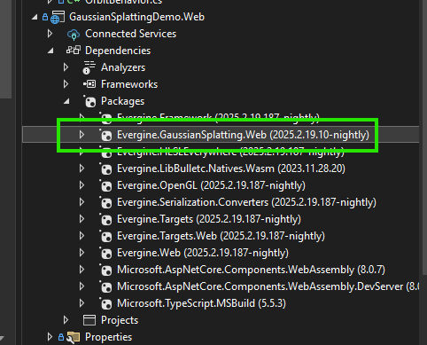
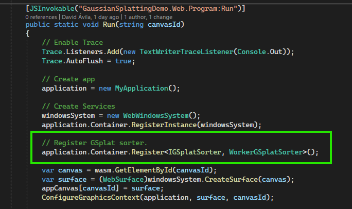
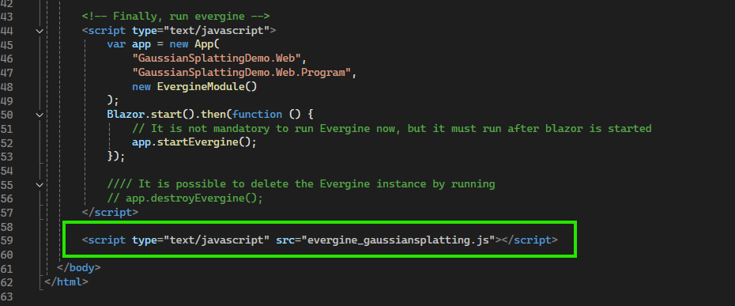

# Setup Gaussian Splatting on the Web Platform
---

3D Gaussian Splatting requires special care and manual work to run on the [Web](../../platforms/web/index.md) platform.

To render Gaussian Splatting, Evergine internally creates a separate thread to perform a sorting algorithm for all splats. Due to .NET idiosyncrasies with WASM and the Web platform, you will need to follow these steps:

## Setup Gaussian Splatting in Your Web Application

Prior to these steps, you need to:
- Properly set up the rest of the requirements provided in the [Getting Started](getting_started.md) document.
- Ensure that your Evergine application has a valid Web profile.

### 1. Add the Evergine.GaussianSplatting.Web NuGet Package

Add the `Evergine.GaussianSplatting.Web` NuGet package to your Web profile project (typically named **[ApplicationName].Web**).

> [!NOTE]
> The version must match the installed Evergine.GaussianSplatting add-on version.



### 2. Register a Gaussian Splatting Sorter for the Web

Now that you have added the NuGet package, add the following code in the **Program.cs** file in the same project, inside your `Run()` method:

```cs
// Register GSplat sorter.
application.Container.Register<IGSplatSorter, WorkerGSplatSorter>();
```



### 3. Add the JS File to Your index.html

In your `index.html` file, add the following line at the end of the file:

```html
<script type="text/javascript" src="evergine_gaussiansplatting.js"></script>
```



### 4. Configure Web App Headers for Multithreading

To launch web worker threads in the web environment, add the following code to your **Program.cs** file located in your **[ApplicationName].Web.Server** project, just after the `var app = builder.Build();` line. This configuration removes certain browser security restrictions related to Web Workers, allowing Evergine to create background threads safely.

```cs
if (app.Environment.IsDevelopment())
{
    app.UseWebAssemblyDebugging();
}

void ApplyHeaders(IHeaderDictionary headers)
{
    headers["Cross-Origin-Embedder-Policy"] = "require-corp";
    headers["Cross-Origin-Opener-Policy"] = "same-origin";
}

app.Use(async (context, next) =>
{
    ApplyHeaders(context.Response.Headers);
    await next();
});
```


### Configure Headers in the React Template (Vite)

If you are using the **Evergine React template**, you must also configure the same headers in your SPA project so that local execution works correctly.
Since Vite is used as the development server, update your `vite.config.ts` file to include the following:

```javascript
plugins: [
    plugin(),
    {
        name: 'configure-response-headers',
        configureServer: (server) => {
            server.middlewares.use((_req, res, next) => {
                res.setHeader(
                    'Cross-Origin-Opener-Policy',
                    'same-origin'
                );
                res.setHeader(
                    'Cross-Origin-Embedder-Policy',
                    'require-corp'
                );
                next();
            });
        },
    },
],
```
