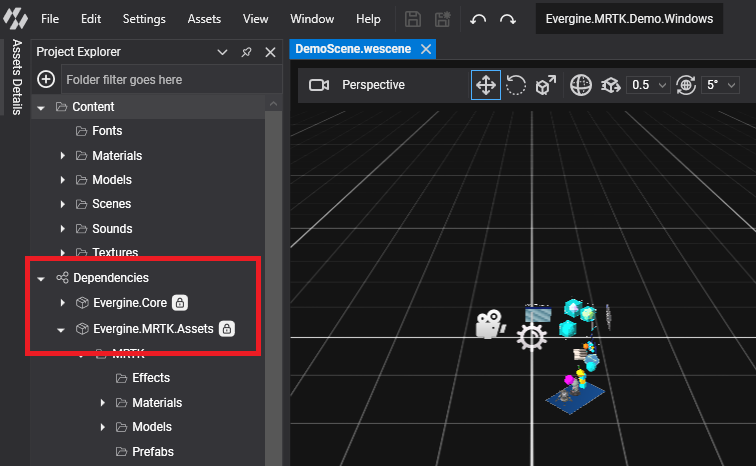
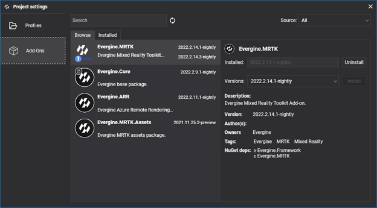
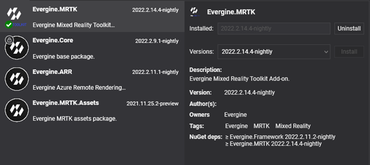
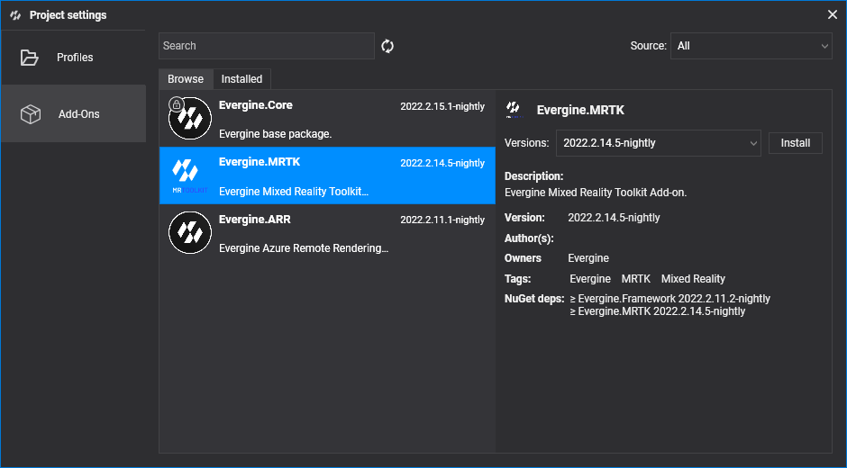
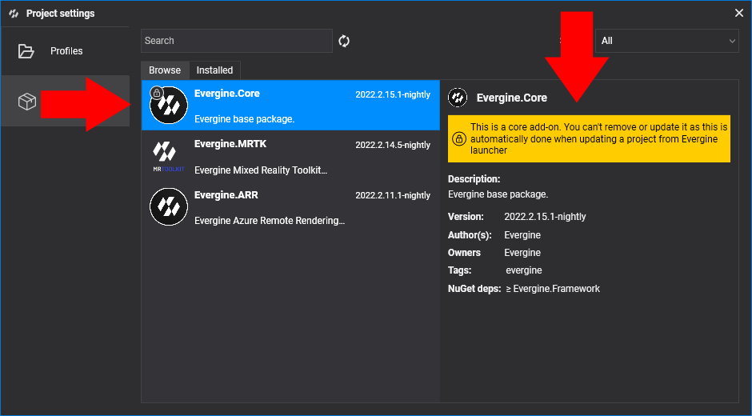
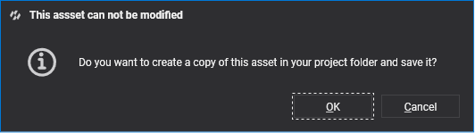
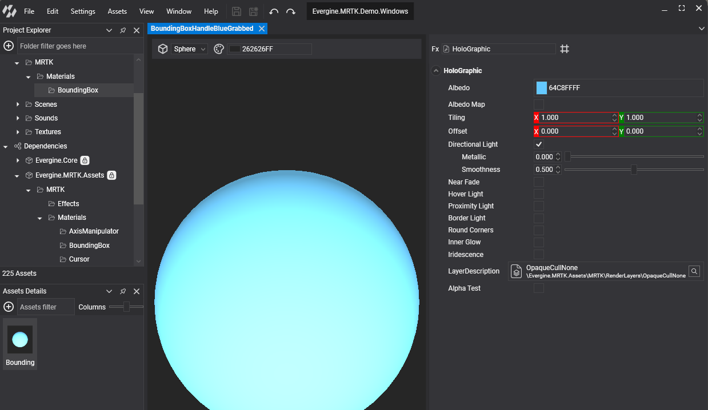

# Add-ons

---

Add-ons are Evergine packages that bring a complete feature to your project: assets, prefabs, components, behaviors, effects, and the NuGet packages that implement them. You install them from Evergine Studio, and their assets appear in your project as read-only dependencies that you can use like your own.

The Evergine team publishes add-ons for extended reality, medical imaging, geospatial data, point clouds, and Gaussian Splatting. You can also consume add-ons from your own private or nightly sources.

## Available add-ons

| Add-on | Package | What it is for | Platforms |
| --- | --- | --- | --- |
| [MRTK](mrtk/index.md) | `Evergine.MRTK` | Hand and controller pointers, pressable buttons, sliders, bounding boxes, and XR user controls. | Meta Quest, Pico, Windows (OpenXR, OpenVR, or mouse and keyboard emulation) |
| [XRV](xrv/index.md) | `Evergine.Xrv.Core` and one package per module | An application framework built on MRTK: hand menu, floating windows, settings, help, themes, localization, and ready-made modules. | Meta Quest, Pico, Windows (for development) |
| [Gaussian Splatting](gaussiansplatting/index.md) | `Evergine.GaussianSplatting` | Load and render 3D Gaussian Splatting scenes (`.ply`, `.splat`, `.spz`, `.ksplat`, `.sog`, LCC). | Windows, Android, iOS, Web (WebGL and WebGPU) |
| [DICOM](dicom/index.md) | `Evergine.Dicom` | Load DICOM medical image series and render them as 2D slices or as a 3D volume. | Windows, Web |
| [Point Cloud](pointcloud/index.md) | `Evergine.PointCloud` | Stream and render massive point clouds (E57, LAS, LAZ, PCD, EPC) with a progressive GPU render path. | Windows |
| [Cesium](cesium/index.md) | `Evergine.Cesium` | Stream Cesium ion terrain, 3D buildings, and imagery, and place entities at geodetic coordinates. | Windows |

## Add-ons in Evergine Studio

The **Dependencies** node of the **Project Explorer** lists the add-ons installed in your project. Each add-on shows its assets in its own folder, so you can drag its prefabs, materials, and other assets into your scenes.



## Add-ons Manager

The **Add-ons Manager** installs, updates, and removes add-ons. It lives in the **Add-Ons** tab of [Project Settings](../evergine_studio/settings.md), and you can open it in three ways:

1. From the **File** menu, select **Manage dependencies**.
2. In the **Project Explorer**, right-click the **Dependencies** node and select **Manage dependencies**.
3. Open **Project Settings** and select the **Add-Ons** tab.

<!-- CAPTURE: addons_manager.png; Evergine Studio develop, Project Settings window with the Add-Ons tab selected, Browse tab listing several add-ons (MRTK, Gaussian Splatting, DICOM) and one of them selected so the detail view with the Versions selector and NuGet dependencies is visible -->



The manager has two tabs: **Browse** lists every add-on available in the configured sources, and **Installed** lists the add-ons your project uses. Above the tabs you find:

* A search box that filters by name and tags.
* A **Source** selector that limits the results to one package source.

Each item in the list shows the add-on name, icon, and description, and:

* A badge under the icon: a green tick when you use the latest version, or a blue arrow when a newer version is available.
* The latest available version and, if the add-on is installed, the installed version. When both match, a single label is shown.
* Buttons to install the latest version or remove the add-on, which appear when you move the mouse over the item.



Select an item to open its detail view. From there you can install or uninstall the add-on, or pick a specific version to install.



The **NuGet deps** section lists the minimum versions of the engine packages and third-party NuGet packages that the add-on needs:

* Engine package versions must be aligned across your project. If an add-on requires a newer engine version than the one you use, Evergine Studio schedules a project restart to update it.
* Third-party NuGet packages with an explicit version are added or updated automatically when you install the add-on.
* NuGet packages listed without a version number are not added for you. Add them to your projects manually.

Core add-ons such as `Evergine.Core` show a lock icon. You cannot remove or update them from the manager; Evergine Launcher updates them when you update the project's Evergine version.



## Private and nightly add-on sources

The public source contains the add-ons published by the Evergine team. Evergine can also read add-ons from your own sources: a local folder or an Azure Storage container. Use them to test nightly builds or to distribute internal add-ons that are not published.

Sources are declared in an `Evergine.config` file placed next to your project's `.weproj` file. You can write it by hand or add entries with the `sources add <name> <uri>` command of the Evergine project CLI.

```json
{
  "Sources": {
    "evergine-nightly": "https://everginestudio.blob.core.windows.net/nightly",
    "local-repo": "C:/EvergineFeeds/local"
  }
}
```

- **Name** (the key): any unique name. The Add-ons Manager shows it in the **Source** selector.
- **URI** (the value): an absolute local folder path or an Azure Storage container URL. Append a SAS token to the URL if the container requires authentication.

> [!IMPORTANT]
> Local folders must be absolute paths. A relative path is interpreted as a storage URL and the source fails to load.

## Customize add-on assets

Assets that come from an add-on are read-only. The Project Explorer marks them with a lock icon: 

You can still edit one. When you save a modified add-on asset, Evergine Studio asks whether you want to create a copy of it in your project:



The copy is stored in your project folder and overrides the asset provided by the add-on. This lets you adapt Evergine core assets, or any add-on asset, to your application without changing the package.



## In this section

* [MRTK](mrtk/index.md)
* [XRV](xrv/index.md)
* [Gaussian Splatting](gaussiansplatting/index.md)
* [DICOM](dicom/index.md)
* [Point Cloud](pointcloud/index.md)
* [Cesium](cesium/index.md)
