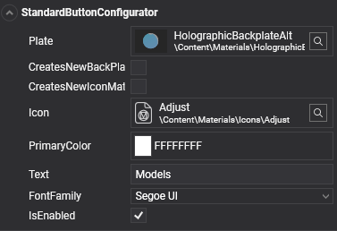
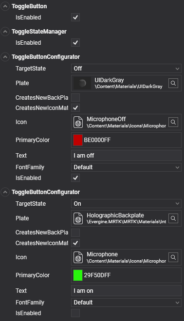
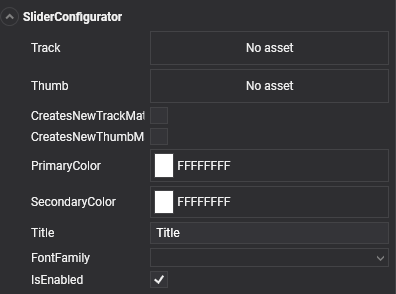

# Configurators

---



Configurator components expose the settings you change most often on a control, such as its text, icon, and colors, in one place. Add a configurator to the root entity of a prefab instance, and it applies its values to the child entities for you. Some configurators also extend the control, for example with per-state styles for toggle buttons.

The test scenes of the [MRTK demo project](demo_project.md) show every configurator in use.

## Standard button configurator

`StandardButtonConfigurator` customizes the icon, text, and back plate of a button. By default, the materials are shared between all the buttons that use them. To change the color of one button without affecting the others, enable `CreatesNewBackPlateMaterialInstance` and `CreatesNewIconMaterialInstance`.

| Property | Default | Description |
| --- | --- | --- |
| `Plate` | `null` | Material of the button's back plate. |
| `CreatesNewBackPlateMaterialInstance` | `false` | Creates a material instance for the back plate, so runtime changes do not affect other controls that share the material. |
| `CreatesNewIconMaterialInstance` | `false` | Creates a material instance for the icon, for the same reason. |
| `AllowBackPlateNullMaterial` | `false` | Allows a `null` back plate material, which hides the plate. |
| `AllowIconNullMaterial` | `false` | Allows a `null` icon material, which hides the icon. |
| `Icon` | `null` | Material of the button icon. |
| `PrimaryColor` | `Color.White` | Tints the icon and sets the text color. |
| `Text` | `null` | Text displayed on the button. |
| `TextScale` | `0.006` | Scale factor of the button text. |
| `Font` | `null` | Font of the button text. |

The configurator is a regular component, so you can also set it from code:

```csharp
using Evergine.Common.Graphics;
using Evergine.Framework;
using Evergine.MRTK.SDK.Features.UX.Components.Configurators;

public class ButtonLabel : Component
{
    [BindComponent]
    private StandardButtonConfigurator configurator = null;

    protected override void OnActivated()
    {
        base.OnActivated();
        this.configurator.Text = "Start";
        this.configurator.PrimaryColor = Color.Yellow;
    }
}
```

## Toggle buttons

Adding a `ToggleButton` component to a button gives it two styles, one for the *on* state and one for the *off* state. `ToggleButton` adds a `ToggleStateManager` if the entity does not have one, and the state manager adds one `ToggleButtonConfigurator` per state. `ToggleButtonConfigurator` has the same properties as the standard button configurator, plus `TargetState`, which selects the state it styles.



Read or change the state with `ToggleButton.IsOn`, and subscribe to `ToggleButton.Toggled` to react when the user toggles it. To make a set of toggle buttons behave like radio buttons, add a `ToggleGroup` component to a common parent; only one button of the group can be on at a time.

The `Buttons.wescene` scene of the [demo project samples](https://github.com/EvergineTeam/MixedRealityToolkit/tree/main/Samples/Evergine.MRTK.Demo/Content/Scenes/Samples) shows standard and toggle buttons.

## Multi-state buttons

Toggle buttons are a two-state case of a general mechanism. Every state manager derives from `BaseStateManager<TState>`, where `TState` is an enum that lists the possible states, and each configurator styles one of those states.

To create a button with more states, define an enum with the states you need, derive a state manager from `BaseStateManager<TState>`, and add one configurator per state. The demo project includes a three-state example, `MultiStateStateManager` with three `MultiStateButtonConfigurator` components, that you can use as a template.

## Slider configurator

`SliderConfigurator` customizes the track, the thumb, and the labels of a slider.



| Property | Default | Description |
| --- | --- | --- |
| `Track` | `null` | Material of the track mesh. |
| `Thumb` | `null` | Material of the thumb mesh. |
| `CreatesNewTrackMaterialInstance` | `false` | Creates a material instance for the track, so runtime changes do not affect other sliders. |
| `CreatesNewThumbMaterialInstance` | `false` | Creates a material instance for the thumb, for the same reason. |
| `PrimaryColor` | `Color.White` | Color of the title text. |
| `SecondaryColor` | `Color.White` | Color of the value text. |
| `Title` | `"Title"` | Title displayed on the slider. |
| `Font` | `null` | Font of the slider texts. |

The `Sliders.wescene` scene of the [demo project samples](https://github.com/EvergineTeam/MixedRealityToolkit/tree/main/Samples/Evergine.MRTK.Demo/Content/Scenes/Samples) shows several slider configurations.
