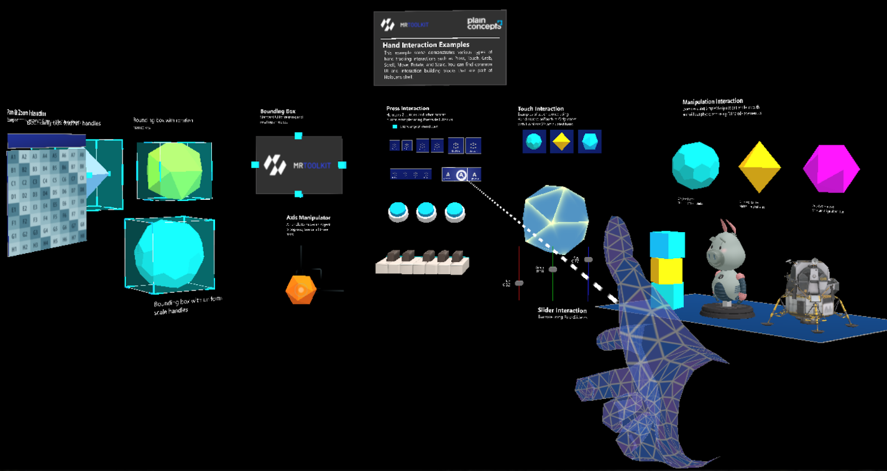

# Demo project

---

The [MRTK demo project](https://github.com/EvergineTeam/MixedRealityToolkit/tree/main/Samples/Evergine.MRTK.Demo) shows every feature of the toolkit in one scene, grouped in areas. It includes profiles for Windows, Meta Quest, and Pico, so you can run it with the [desktop emulation](pointers_and_control.md#desktop-emulation) or on a headset. The `Content/Scenes/Samples` folder also contains one scene per control, such as `Buttons.wescene`, `Sliders.wescene`, and `ListViewScene.wescene`.

## Press interaction

Examples of the `PressableButton` component:

- Standard buttons.
- Toggle buttons.
- Piano keys built from pressable buttons.

## Touch interaction

Examples of near interaction that use the demo's `HandInteractionTouch` behavior, which implements `IMixedRealityTouchHandler`.

## Slider interaction

Sliders built with the `PinchSlider` component. Moving them changes the color of a connected object in real time.

## Manipulation interaction

Objects with the `SimpleManipulationHandler` component, configured in different ways:

- Objects with constrained manipulation.
- Objects driven by the physics engine that the user can throw. They return to their starting position if they move too far.

## Bounding box

Objects with the `BoundingBox` component, which adds handles to rotate and scale them. The handles can be hidden, and the component can be combined with `SimpleManipulationHandler` to move the object as well.

## Axis manipulation handler

An example of the `AxisManipulationHandler` component: a three-axis gizmo that moves an object along one axis or a plane without changing its other properties.

## Pan and zoom

The demo's `HandInteractionPanZoom` behavior lets the user pan and zoom content with near and far interaction.

## Voice commands

The demo registers a `FakeVoiceCommandService` that implements `IVoiceCommandService`. Hold **Tab** and type the number of a command to simulate that it was recognized, which shows how `SpeechHandler` components react without a speech recognizer.
