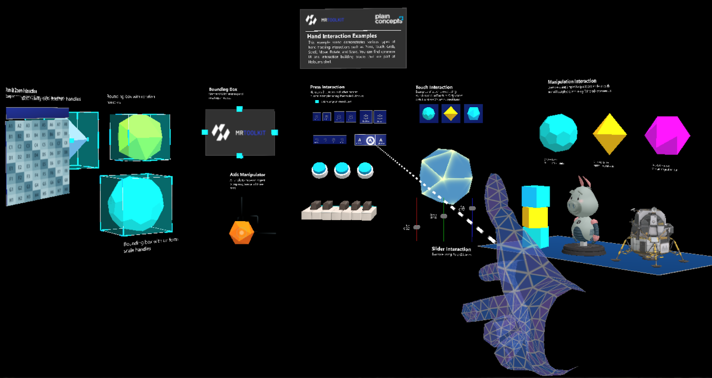

# Demo Project
---
The demo scene in the MRTK repository showcases the toolkit's currently implemented features and their practical applications.

## Press Interaction
This area demonstrates interactions using the _PressableButton_ class, including:
- Standard buttons.
- Toggle buttons.
- Piano keys for musical interaction.

## Touch Interaction
Here, you’ll find examples using _HandInteractionTouch_ to demonstrate touch behavior, specifically for _near interaction_.

## Slider Interaction
This section features sliders that utilize the _PinchSlider_ class. These sliders allow users to modify the color of a connected object, offering an example of real-time customization.

## Manipulation Interaction
Examples here use the _SimpleManipulationHandler_ component, configured to explore varied interaction styles:
- Objects with constrained manipulation settings.
- Objects that interact with the physics engine and can be thrown around, returning to their starting position if they move too far.

## Bounding Box
This group demonstrates the _BoundingBox_ component, which enables rotation, scaling, and handle-based manipulation. Handles can be hidden for simplified interactions, and the component can be combined with _SimpleManipulationHandler_ for more versatility.

## Axis Manipulation Handler
This section includes an example of the _AxisManipulationHandler_ component, featuring a 3-axis handle that allows movement along specific or combined axes without altering other properties.

## Pan and Zoom Control
The _HandInteractionPanZoom_ example enables users to pan and zoom content using both _near_ and _far interaction_, providing flexibility for adjusting the view in mixed reality.