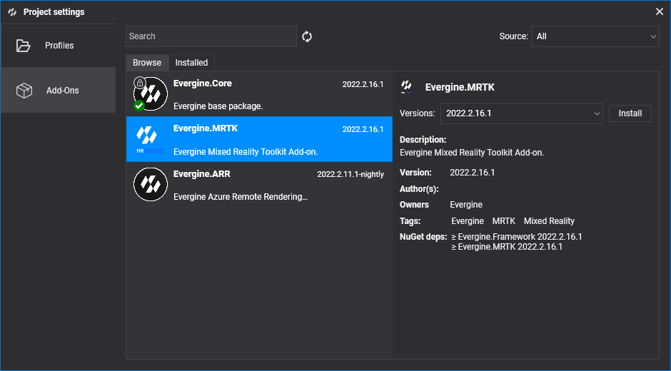

# Getting started with MRTK

---



This page adds MRTK to an Evergine project and prepares a scene to use its pointers and controls. It takes three steps: install the add-on, make your scene inherit from `XRScene`, and tell the scene which assets to use for cursors, hands, and controllers.

## 1. Create or open a project

Create a new project with [Evergine Launcher](../../evergine_launcher/create_project.md), or open an existing one. To run on a headset, add the profile for your device, such as Meta Quest or Pico.

## 2. Install the MRTK add-on

In Evergine Studio, open the [Add-ons Manager](../index.md#add-ons-manager) and install **Evergine.MRTK**. Its assets appear under **Dependencies > Evergine.MRTK** in the Project Explorer.

## 3. Inherit your scene from XRScene

Every scene that uses MRTK must inherit from `Evergine.MRTK.Scenes.XRScene` instead of `Scene`. `XRScene` creates the MRTK root entity, the near and far cursors for each hand and controller, the gaze provider, and the scene managers that dispatch focus and voice events (`FocusProvider` and `VoiceCommandsProvider`). It also registers a physics manager, because the pointers find controls through collisions.

`XRScene` is abstract: you provide the assets it uses by overriding these properties.

```csharp
using System;
using Evergine.MRTK.Scenes;

namespace MyProject.Scenes
{
    public class MyScene : XRScene
    {
        // Materials for the cursor when the user pinches and when the hand is open.
        protected override Guid CursorMatPressed => EvergineContent.MRTK.Materials.Cursor.CursorPinch;

        protected override Guid CursorMatReleased => EvergineContent.MRTK.Materials.Cursor.CursorBase;

        // Material for the tracked hand mesh. Guid.Empty hides the hands.
        protected override Guid HoloHandsMat => EvergineContent.MRTK.Materials.HoloHands;

        // Guid.Empty leaves the spatial mapping mesh without a material, so it is not drawn.
        protected override Guid SpatialMappingMat => Guid.Empty;

        // Texture and sampler for the far pointer ray.
        protected override Guid HandRayTexture => EvergineContent.MRTK.Textures.line_dots_png;

        protected override Guid HandRaySampler => EvergineContent.MRTK.Samplers.LinearWrapSampler;

        // Models shown for physical controllers. Guid.Empty shows no model.
        protected override Guid LeftControllerModelPrefab => EvergineContent.MRTK.Prefabs.DefaultLeftController_weprefab;

        protected override Guid RightControllerModelPrefab => EvergineContent.MRTK.Prefabs.DefaultRightController_weprefab;

        // Maximum length, in meters, of the far cursor ray.
        protected override float MaxFarCursorLength => 0.5f;
    }
}
```

> [!NOTE]
> `XRScene` seals the `CreateScene` method so it can build the MRTK hierarchy first. If you need to add entities or change the scene when it is created, override `OnPostCreateXRScene` instead.

```csharp
protected override void OnPostCreateXRScene()
{
    base.OnPostCreateXRScene();

    // The MRTK cursors already exist here, so you can look up entities or add your own.
}
```

Your project is now ready to use MRTK. Run it on a headset, or on Windows with the [desktop emulation](pointers_and_control.md#desktop-emulation), and continue with [Pointers and control](pointers_and_control.md).
