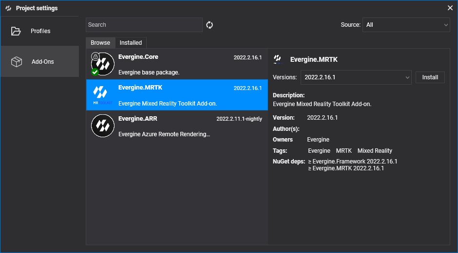

# Getting Started
---
Follow these steps to begin working with Evergine’s Mixed Reality Toolkit (MRTK):

1. **Create or Open a Project**: Start by creating a new Evergine project or open an existing one.
2. **Install MRTK Add-On**: Use the Add-on Management option in Evergine Studio to install the _Evergine.MRTK_ add-on.



3. **Update Scene Classes**: For any scenes that will use MRTK functionality, ensure they inherit from MRTK's _XRScene_ class rather than Evergine's default _Scene_ class. Some material properties specific to MRTK will need to be assigned in these scenes.

```csharp
using System;
using Evergine.MRTK.Scenes;

namespace Evergine.MRTK.Demo.Scenes
{
    public class DemoScene : XRScene
    {
        protected override Guid CursorMatPressed => EvergineContent.MRTK.Materials.Cursor.CursorPinch;

        protected override Guid CursorMatReleased => EvergineContent.MRTK.Materials.Cursor.CursorBase;

        protected override Guid HoloHandsMat => EvergineContent.MRTK.Materials.HoloHands;

        protected override Guid SpatialMappingMat => Guid.Empty;

        protected override Guid HandRayTexture => EvergineContent.MRTK.Textures.line_dots_png;

        protected override Guid HandRaySampler => EvergineContent.MRTK.Samplers.LinearWrapSampler;

        protected override Guid LeftControllerModelPrefab => EvergineContent.MRTK.Prefabs.DefaultLeftController_weprefab;

        protected override Guid RightControllerModelPrefab => EvergineContent.MRTK.Prefabs.DefaultRightController_weprefab;

        protected override float MaxFarCursorLength => 0.5f;
    }
}
```
> [!Note]
> If you encounter an error related to the _CreateScene_ method, it’s because the method is sealed in the _XRScene_ class. If scene modifications are needed, override the _OnPostCreateXRScene_ method instead.

That’s it! Your project is now set up to use MRTK components.