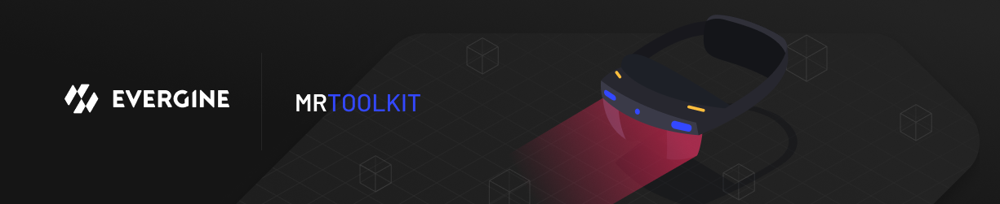

# Mixed Reality Toolkit (MRTK)

---

**Evergine MRTK** is a set of components, prefabs, and assets that speeds up the development of XR applications. It gives you hand and controller pointers, pressable buttons, sliders, bounding boxes, manipulation handlers, and a collection of user controls designed for 3D space. The project is open source under the MIT license and lives in the [MixedRealityToolkit repository](https://github.com/EvergineTeam/MixedRealityToolkit) on GitHub.

MRTK runs on:

- Meta Quest headsets.
- Pico headsets.
- PC VR headsets on Windows, through OpenXR or OpenVR.
- Windows desktop, where the mouse and keyboard emulate the hand pointers so you can test without a headset.

Its design is based on Microsoft's [Mixed Reality Toolkit for Unity](https://github.com/microsoft/MixedRealityToolkit-Unity), adapted to Evergine's entity and component model.

## In this section

* [Getting started](getting_started.md)
* [Pointers and control](pointers_and_control.md)
* [Using prefabs and customization](prefabs.md)
* [Configurators](configurators.md)
* [Creating custom controls](custom_controls.md)
* [Built-in user controls](user_controls/index.md)
* [Demo project](demo_project.md)
