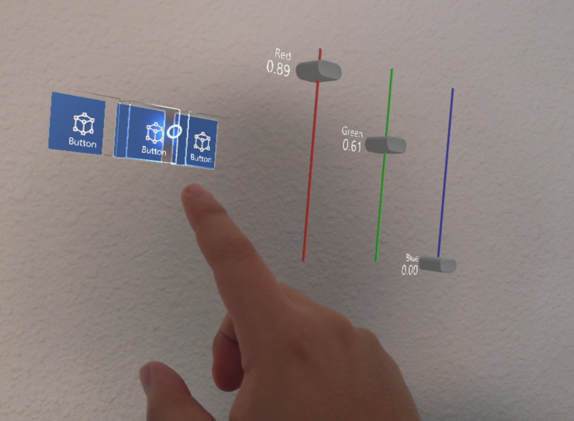
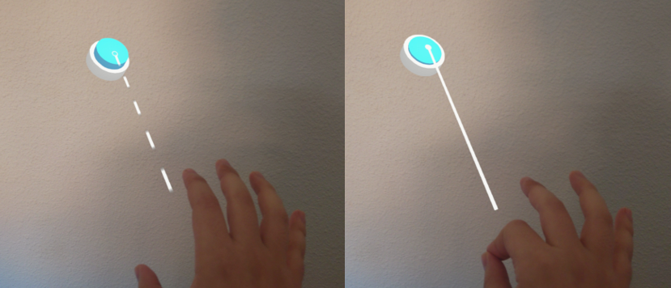
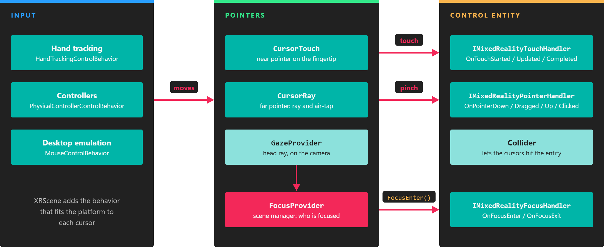

# Pointers and control

---

|||
|:--:|:--:|
| **Near pointer** | **Far pointer** |

MRTK replaces the mouse pointer with pointers that follow the user's hands and controllers. `XRScene` creates them for you, one near and one far pointer per hand, so your controls react to touch, pinch, and gaze without extra setup.

## Interaction modes

- **Near interaction.** When the hand is close to a control, the user touches it with the tip of the index finger. The near pointer (`CursorTouch`) is a small sensor sphere attached to that fingertip.
- **Far interaction.** When the control is out of reach, the user points at it with a ray that comes out of the hand or controller. The far pointer (`CursorRay`) casts that ray and places a cursor where it hits. Pinching the thumb and index finger, the *air-tap* gesture, clicks the control under the cursor.
- **Gaze.** The `GazeProvider` component, added to the camera by `XRScene`, casts a ray from the user's head. Controls that implement focus events also react when the user looks at them.

On devices with hand tracking, the pointers follow the tracked index fingertip. With physical controllers, `XRScene` creates a second set of pointers attached to each controller.

## How pointer events reach your controls

Pointers find controls through the physics engine: each cursor is a sensor body, and a control needs a collider so the cursor can hit it. When a cursor enters, touches, or clicks an entity, MRTK calls the handler interfaces implemented by the components on that entity.

*Input moves the cursors, the cursors hit colliders, and MRTK calls the handler interfaces on the entity that was hit.*

See [Creating custom controls](custom_controls.md) for the events each interface receives.

## Desktop emulation

You can test MRTK in a Windows desktop profile without a headset. When no XR input tracking is available, `XRScene` adds a `MouseControlBehavior` to each hand pointer, and the mouse and keyboard drive them:

| Input | Action |
| --- | --- |
| Hold **Left Shift** | Activates the right-hand pointer. Move the mouse to move it. |
| Hold **Space** | Activates the left-hand pointer. Move the mouse to move it. |
| **Mouse wheel** (while a pointer is active) | Moves the pointer closer to or farther from the camera. |
| **Left mouse button** (while a pointer is active) | Pinches, which performs the air-tap on far controls and grabs objects. |
| Hold **Left Ctrl** (while a pointer is active) | Rotates the active pointer with the mouse instead of moving it. |

