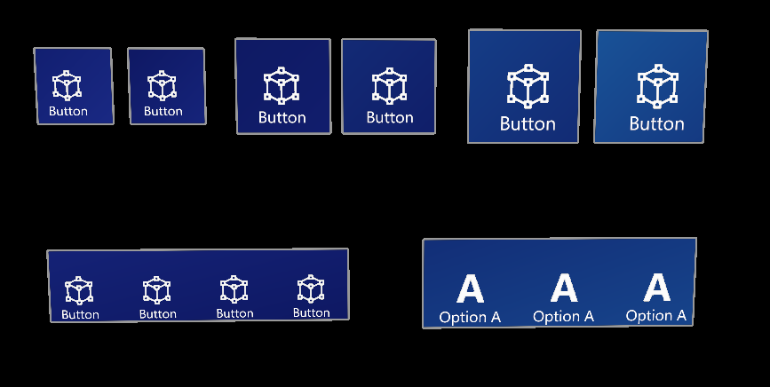
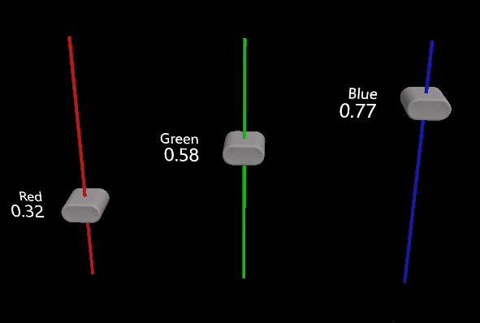
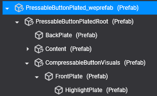
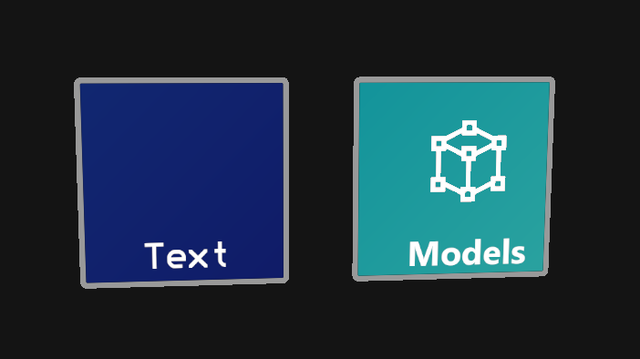
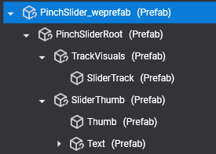
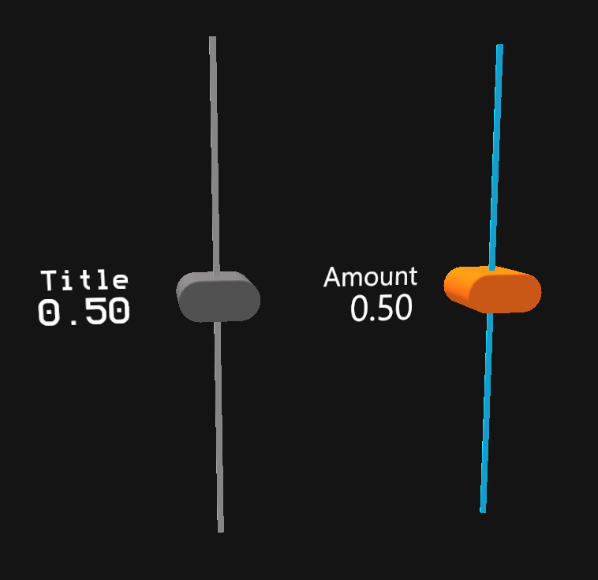

# Using prefabs and customization

---

|||
|:--:|:--:|
| **Buttons** | **Sliders** |

MRTK ships its controls as ready-made prefabs, so you can drag a button or a slider into a scene and use it right away. You find them under **Dependencies > Evergine.MRTK > MRTK > Prefabs** in the Project Explorer.

| Prefab | What it contains |
| --- | --- |
| `PressableButtonPlated.weprefab` | Standard button with a back plate, icon, and text. |
| `PressableToggleButtonPlated.weprefab` | Toggle button with on and off states. |
| `PinchSlider.weprefab` | Slider that the user drags with near or far interaction. |
| `CheckBox.weprefab`, `ComboBox.weprefab`, `ListView.weprefab`, `ScrollView.weprefab` | The [built-in user controls](user_controls/index.md). |
| `Loading.weprefab` | Spinner used as the default loading indicator of the list view. |
| `DefaultLeftController.weprefab`, `DefaultRightController.weprefab` | Controller models used by `XRScene` for physical controllers. |

## Customization

When you add a prefab to a scene, its entity hierarchy becomes visible in Evergine Studio. You can change the look and feel of each instance in the editor without touching the other instances.

|||
|:--:|:--:|
| **Button prefab hierarchy** | **Button before and after customization** |

|||
|:--:|:--:|
| **Slider prefab hierarchy** | **Slider before and after customization** |

For the most common changes, such as the text, the icon, or the plate color, use the [configurator components](configurators.md) on the prefab root instead of editing child entities by hand.

## React to controls from code

Buttons raise `ButtonPressed` and `ButtonReleased` from their `PressableButton` component, and sliders raise `ValueUpdated` from their `PinchSlider` component. Bind them from a component on the prefab root and subscribe while the component is active.

```csharp
using System;
using Evergine.Framework;
using Evergine.MRTK.SDK.Features.UX.Components.PressableButtons;
using Evergine.MRTK.SDK.Features.UX.Components.Sliders;

public class VolumePanel : Component
{
    [BindComponent(source: BindComponentSource.Children, tag: "MuteButton")]
    private PressableButton muteButton = null;

    [BindComponent(source: BindComponentSource.Children, tag: "VolumeSlider")]
    private PinchSlider volumeSlider = null;

    protected override void OnActivated()
    {
        base.OnActivated();
        this.muteButton.ButtonPressed += this.OnMutePressed;
        this.volumeSlider.ValueUpdated += this.OnVolumeUpdated;
    }

    protected override void OnDeactivated()
    {
        base.OnDeactivated();

        // Unsubscribe so a disabled panel does not keep reacting to its controls.
        this.muteButton.ButtonPressed -= this.OnMutePressed;
        this.volumeSlider.ValueUpdated -= this.OnVolumeUpdated;
    }

    private void OnMutePressed(object sender, EventArgs e)
    {
        this.volumeSlider.SliderValue = 0f;
    }

    private void OnVolumeUpdated(object sender, SliderEventData e)
    {
        // SliderValue goes from 0 to 1.
        float volume = e.NewValue;
    }
}
```
