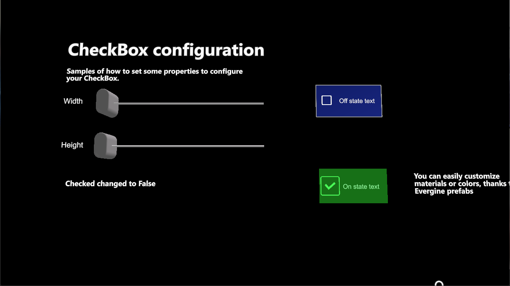

# CheckBox

---



The `CheckBox` control lets the user make an on or off choice, such as accepting a condition or enabling a setting. It shows a box that is filled when checked and empty when unchecked, and it toggles when the user taps it. Internally it is a toggle button, so it reacts to near and far interaction like the other MRTK buttons.

The control is distributed as the `CheckBox.weprefab` prefab.

## Usage

```csharp
using System;
using Evergine.Framework;
using Evergine.Framework.Graphics;
using Evergine.MRTK.SDK.Features.UX.Components.Selection;

public class GridToggle : Component
{
    [BindComponent(source: BindComponentSource.Children)]
    private CheckBox checkBox = null;

    [BindComponent(source: BindComponentSource.Scene, tag: "Grid")]
    private Transform3D grid = null;

    protected override void OnActivated()
    {
        base.OnActivated();
        this.checkBox.IsCheckedChanged += this.OnIsCheckedChanged;
    }

    protected override void OnDeactivated()
    {
        base.OnDeactivated();
        this.checkBox.IsCheckedChanged -= this.OnIsCheckedChanged;
    }

    private void OnIsCheckedChanged(object sender, EventArgs e)
    {
        // Show the grid entity only while the box is checked.
        this.grid.Owner.IsEnabled = this.checkBox.IsChecked;
    }
}
```

## Properties

| Property | Default | Description |
| --- | --- | --- |
| `Size` | `(0.064, 0.032)` | Width and height of the control, in meters. |
| `IsChecked` | `false` | Whether the box is checked. Setting it from code updates the control. |

## Events

| Event | Description |
| --- | --- |
| `IsCheckedChanged` | Raised when the user toggles the check box. |
