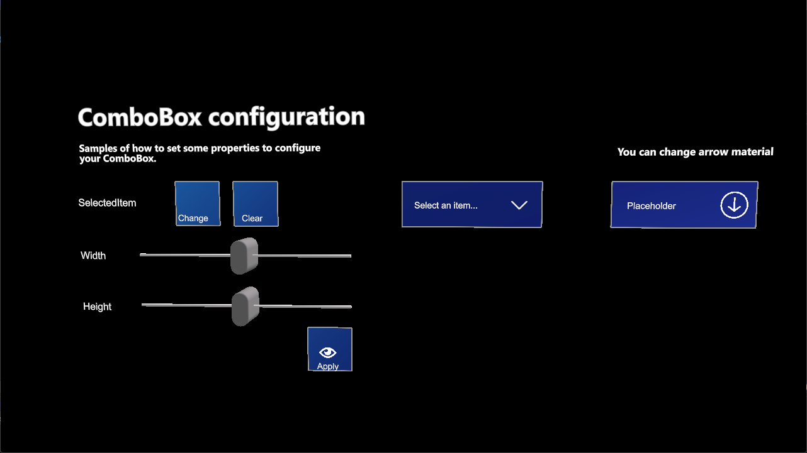

# ComboBox

---



The `ComboBox` control lets the user pick one option from a drop-down list. It shows the selected item, or a placeholder text when nothing is selected, and opens a popup with the options when the user taps it. The popup is a [list view](listview.md), so you fill it with the same data adapters.

The control is distributed as the `ComboBox.weprefab` prefab.

## Usage

```csharp
using System;
using System.Collections.Generic;
using Evergine.Framework;
using Evergine.MRTK.SDK.Features.UX.Components.Lists;
using Evergine.MRTK.SDK.Features.UX.Components.Selection;

public class QualitySelector : Component
{
    [BindComponent(source: BindComponentSource.Children)]
    private ComboBox comboBox = null;

    protected override void OnActivated()
    {
        base.OnActivated();

        this.comboBox.PlaceholderText = "Select quality";
        this.comboBox.DataSource = new ArrayAdapter<string>(new List<string> { "Low", "Medium", "High" });
        this.comboBox.SelectedItemChanged += this.OnSelectedItemChanged;
    }

    protected override void OnDeactivated()
    {
        base.OnDeactivated();
        this.comboBox.SelectedItemChanged -= this.OnSelectedItemChanged;
    }

    private void OnSelectedItemChanged(object sender, EventArgs e)
    {
        var quality = this.comboBox.SelectedItem as string;
    }
}
```

## Properties

| Property | Default | Description |
| --- | --- | --- |
| `DataSource` | `null` | Data adapter that provides the options. See [data adapters](listview.md#populate-data). |
| `SelectedItem` | `null` | The selected option. |
| `PlaceholderText` | `null` | Text displayed when no option is selected. |
| `ArrowMaterial` | `null` | Material of the drop-down arrow. |
| `Size` | `(0.096, 0.032)` | Width and height of the control, in meters. |
| `MaxItemsHeight` | `0.06` | Maximum height of the popup, in meters. Longer lists scroll. |
| `IsPopupOpen` | `false` | Read-only. Indicates whether the popup is open. |

## Events

| Event | Description |
| --- | --- |
| `SelectedItemChanged` | Raised when the selection changes. |
