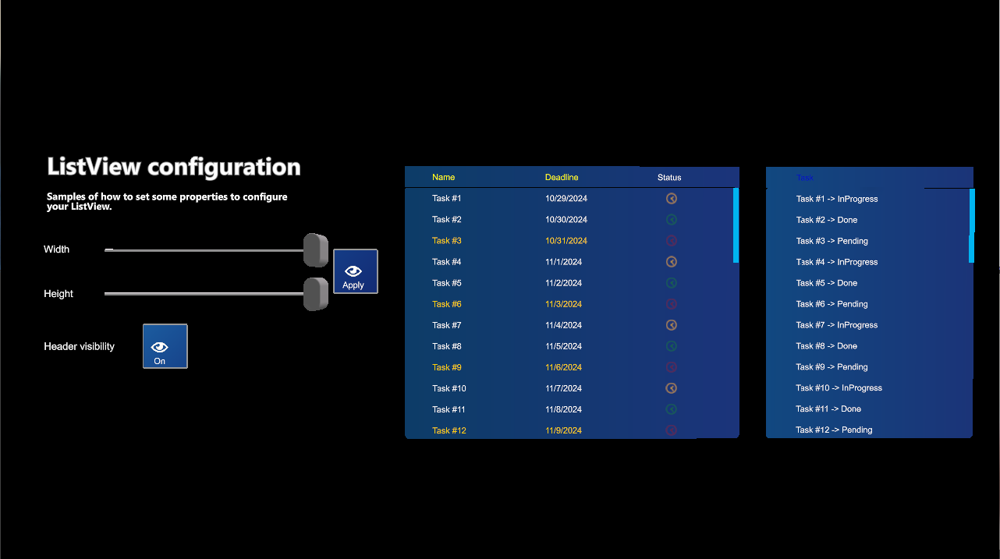

# Built-in user controls

---

MRTK includes a set of user controls for common UI layouts in XR applications: scrollable panels, lists, drop-down selectors, and check boxes. They come from our experience building XR projects, and each one is distributed as a prefab under **Dependencies > Evergine.MRTK > MRTK > Prefabs**, so you add them to a scene like any other prefab and configure them from Evergine Studio or from code.

All the controls live in the `Evergine.MRTK.SDK.Features.UX.Components` namespace family: `Scrolling` for the scroll view, `Lists` for the list view and data adapters, and `Selection` for the combo box and check box.

## In this section

* [Scroll view](scrollview.md): a panel that scrolls content larger than its visible area, vertically, horizontally, or both.
* [List view](listview.md): rows and columns of data populated through data adapters, with selection and custom cell renderers.
* [ComboBox](combobox.md): a drop-down list to pick one item among several.
* [CheckBox](checkbox.md): a two-state control for on and off choices.
